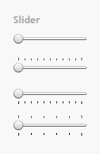
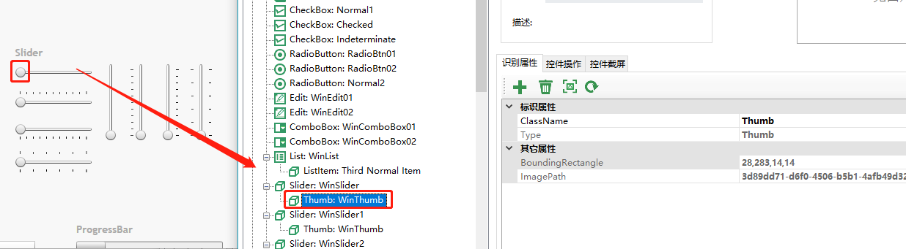
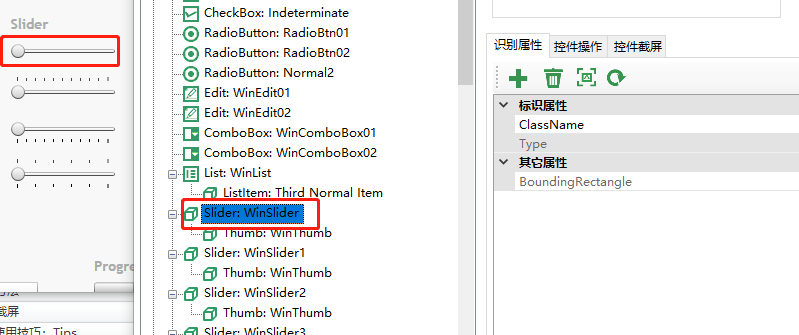
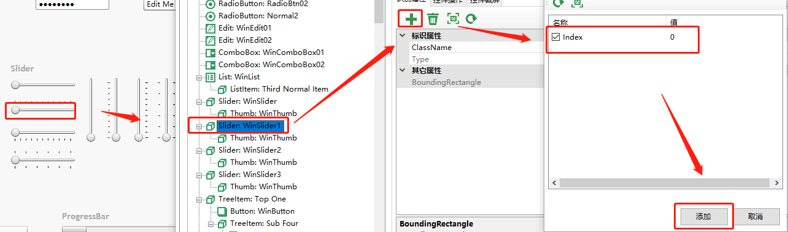
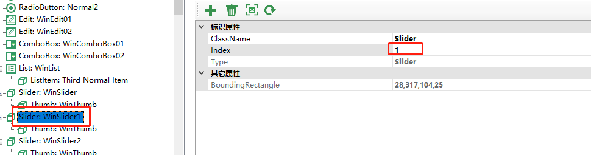
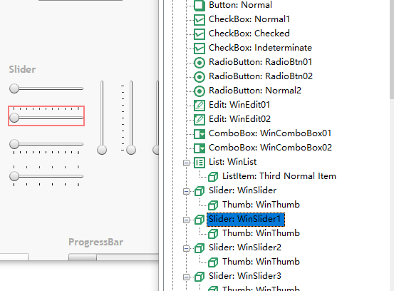

# 使用技巧：Tips

## 多个相同控件不能单独区别

**问题描述**：有时候我们会遇到同一页面有多个同一类型的控件，而传统识别方式识别出来都是同一个控件，例如 （如下图）  有4个slide控件，传统识别都会指向第一个

**解决方法**： 为控件添加Index 属性 1. 先识别出第一个slider  2. 添加第二个slider 控件 第二个slider控件添加成功之后发现指向的还是第一个控件  3. 为slider添加index值。选择第二个slider控件—点击添加属性按钮--勾选Index—点击“添加”  4. 更改index 值 将新添加的index值由0更改为1  再高亮元素，成功识别第二个slider元素。 

* **添加对象后选择高亮定位不到控件**

LeanRunner用控件的属性组合查找控件。所有的识别属性用”And”的方式查找，即所有属性都匹配的控件。有些控件属性会在下一次运行时变化。导致查找不到。可以在添加对象后删除的不需要的属性重新定位控件。通常情况下，设计良好的应用可以只用AutomationId就识别对象。  
识别后推荐的属性可能会超过必须，当不需要这么多属性也能唯一标识对象时，可以选择删除一些识别属性。

## 水平滚动与垂直滚动

**问题描述**：有时候我们会遇到页面内容比较多需要鼠标滚动才能显示出元素。 **解决方法**：有两种方法可供我们参考。 1. 使用 Vscroll 或 Hscroll 方法， 参数选项：0 ~ 100滚动到百分比，或是设置这几个值："PageUp" 向上翻页，“PageDown"向下翻页，"ArrowUp"向上微滚动，”ArrowDown"向下微滚动。 2. 使用Wheel 方法：模拟鼠标滚轮滚动，正值往前滚动，负值往后滚动。例如 1往前滚动一格，-1往后滚动一格

