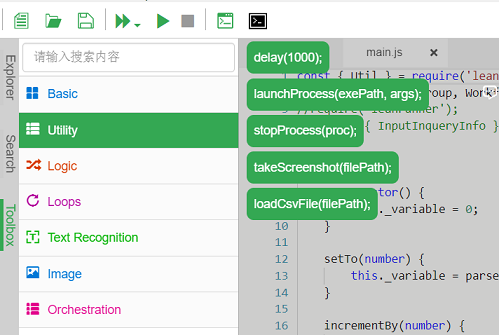

# 代码编辑调试

### 工具箱

LeanRunner设计器提供了代码工具箱，如下图：



能够通过拖拽对应的工具条，实现代码的快速生成。生成代码时，也会在文件头插入相应的库的require调用。

### 智能提示
通过require调用引入"leanpro.win"库，可以访问到TestModel的对象模型，并获得智能提示。

其中TestModel是对象模型的操作对象。可以通过loadModel调用返回测试对象模型。例如下面的代码：

```javascript

const { TestModel } = require('leanpro.win');                   //line 1
let model = TestModel.loadModel(__dirname + '/test.tmodel');    //line 2
(async function () {                                            //line 3
    await model.getButton("Five").click(0, 0, 1);               //line 4
})();                                                           //line 5

```

1. 首先从内置的"leanpro.win"库中引入TestModel类，即 
```javascript
const { TestModel } = require('leanpro.win'); 
```
这样可以直接获得TestModel或其它相关对象，来使用。

2. 第二行通过TestModel.loadModel获得model对象模型实例，可在之后针对模型中的对象做更多的操作。

Node.js中对象的所有操作都是异步的，即返回的是Promise对象。意味着如果要等待它完成再进行下一步可用await调用，await函数需要放在async 函数中。即line 3 ~ 5的调用。关于更多的async/await的调用方式，可以参见JavaScript语法。
