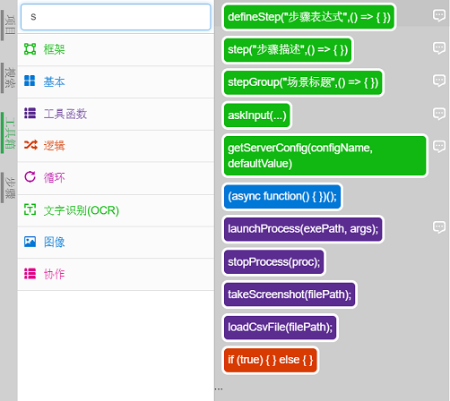
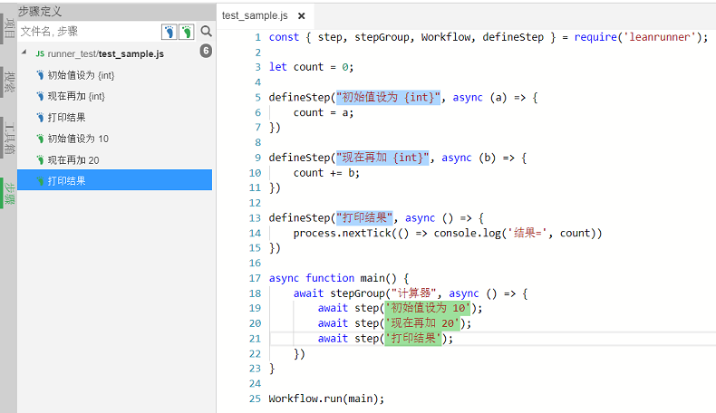

# 代码编辑调试

### 工具箱

LeanRunner设计器提供了代码工具箱，如下图：



能够通过拖拽对应的工具项，实现代码的快速生成。生成代码时，也会在文件头插入相应的库的require调用。

### 智能提示

通过require调用引入"leanpro.win"库，可以访问到`TestModel`的对象，并获得智能提示。

其中TestModel是访问[对象模型](../_book/a_vocabularies.md#object_model)的类。可以通过调用它的loadModel方法加载一个对象模型文件，并返回对象模型实例。例如下面的代码：

```javascript

const { TestModel } = require('leanpro.win');                   //line 1
let model = TestModel.loadModel(__dirname + '/test.tmodel');    //line 2
(async function () {                                            //line 3
    await model.getButton("Five").click(0, 0, 1);               //line 4
})();                                                           //line 5

```

1. 首先从内置的"leanpro.win"库中引入TestModel类，即：

   ```javascript
   const { TestModel } = require('leanpro.win'); 
   ```

   这样可以直接获得TestModel或其它相关对象，来使用。

2. 第二行通过TestModel.loadModel获得model对象模型实例，可在之后针对模型中的对象做更多的操作。

   {{book.product}}中对象的所有操作都是异步的，即返回的是Promise对象。意味着如果要等待它完成再进行下一步可用await调用，await函数需要放在async 函数中。即line 3 ~ 5的调用。关于更多的async/await的调用方式，可以参见JavaScript语法。


### 步骤浏览和搜索

LeanRunner的特点是支持行为驱动(BDD)。通过行为驱动，用户可以通过首先用自然语言定义业务流程、场景和步骤，然后将它们转换为代码。

在代码中，通过**步骤定义**设定模板，然后用不同的参数调用步骤，达到复用步骤定义的作用。

当打开一个项目时，可以在左边打开步骤搜索面板，浏览或搜索步骤定义：

如下图：



可以通过选择蓝色、绿色的步骤过滤选项，分别过滤步骤定义和步骤调用。点击某项，会跳转到对应的步骤代码中。