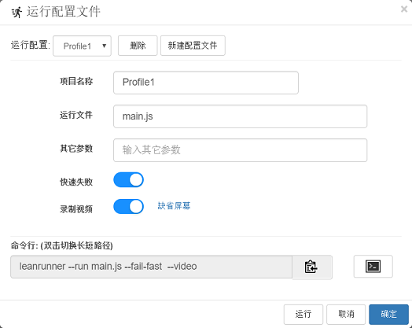

# 运行

LeanRunner设计器支持多种RPA脚本运行方式，包括：

* 运行整个项目
* 运行单个脚本文件
* 运行一个项目配置文件

同时，用户可以选择在编辑器界面中直接执行脚本，或在命令行窗口中执行脚本。

### 编辑窗口中运行

脚本编辑器为多文档界面，同时打开多个文件。当某个JavaScript脚本文件为当前激活的标签页时，脚本运行按钮为允许状态。当切换为其它类型文件的标签页时，运行按钮为禁止状态。

在打开项目的情况下，项目运行按钮始终为允许状态。


### 命令行方式运行
LeanRunner安装好之后，该应用已配置在PATH环境变量中，意味着打开命令行窗口，在任意路径下执行 “leanrunner”，都可以执行LeanRunner应用。

如果你要执行一个脚本，可以带上“--run”或“-r”参数，这时会在命令行执行这个脚本，而不是用编辑器打开编辑这个脚本。

例如，你可以将LeanRunner自带的样例复制到c:\temp\下，并在命令行窗口中，在该目录下运行 `leanrunner --run main.js`，如下图：


如果你已经在LeanRunner编辑器中打开了你的项目和要执行的脚本，则有简便的方法可以直接生成该命令行。直接在工具条上点击“复制运行命令”，将该脚本的运行命令复制到剪贴板上，再点击旁边的黑色图标打开命令行窗口，复制进去就可以运行了。按钮如下图：


如果脚本运行的输出信息要记录到日志文件，可以用"--log" 或 "-l"参数，例如：

```
leanrunner --run main.js --log main.log
```

## 项目运行配置

直接运行项目时选择的是缺省项目的运行配置。缺省情况下，项目运行会执行目录中的main.js文件，不会录制视频。

用户可以通过配置，定制自己的项目运行配置。

点击“运行”=>“编辑运行配置文件...”，会打开下面的项目运行配置对话框。



在这个对话框中，用户可以配置运行命令，添加额外的参数，设置视频的录制，是否在出错的时候立即结束脚本的执行。


## 全局运行配置

### 日志级别

点击“文件”=>“设置”=>“高级”，可配置脚本运行的日志级别，可设置`error`、`warn`、`info`几个级别，在运行中`error`级别只在出错时输出出错信息，`warn`级别输出警告信息，`info`级别信息输出最多，一般用于脚本的调试。


### 运行时最小化窗口

设置这个选项后，运行脚本前会最小化窗口。


### JavaScript

JavaScript和VBScript执行时需要使用windows自带的脚本引擎，即WScript，执行引擎为windows自带的cscript.exe或wscript.exe。

LeanRunner支持用JavaScript脚本语言开发自动化测试脚本，它的优势是无需编译，小巧灵活。用模型管理器生成对应语言的代码，然后拖拽或者粘贴到您的编辑器中去。
除了用其专业的脚本编辑器外，您还可以用LeanRunner自带的脚本测试编辑器编辑运行脚本：

点击“操作”=>“脚本测试编辑器”

会打开脚本测试编辑器界面：


根据您在设置窗口设定的语言不同，它会将对应的模型加载代码自动填充在了这个编辑器中，您只需将对应的测试对象的调用拖拽到这个编辑器中，然后点击“执行”，就会运行这个自动化脚本。您还可以点击“加载…”按钮，加载一个预先写好的文件来执行。

下面提供部分VBScript的代码样例：

```VBScript
Dim auto
Set auto = CreateObject("Win.Automation")

'button
auto.GetWindow("className:=Window","title:=SimpleStyles").WinButton("className:=Button","name:=Default").WinText("className:=TextBlock","name:=Default").Click 0, 0, 1

auto.GetWindow("className:=Window","title:=SimpleStyles").WinButton("className:=Button","name:=Normal").WinText("className:=TextBlock","name:=Normal").Click 0, 0, 1

'check box
auto.GetWindow("className:=Window","title:=SimpleStyles").WinCheckBox("className:=CheckBox","name:=Normal").WinText("className:=TextBlock","name:=Normal").Click 0, 0, 1

auto.GetWindow("className:=Window","title:=SimpleStyles").WinCheckBox("className:=CheckBox","name:=Checked").WinText("className:=TextBlock","name:=Checked").Click 0, 0, 1

auto.GetWindow("className:=Window","title:=SimpleStyles").WinCheckBox("className:=CheckBox","name:=Indeterminate").WinText("className:=TextBlock","name:=Indeterminate").Click 0, 0, 1
```
安装包已经提供了完整的样例代码，在C:\Program Files (x86)\LeanRunner\samples目录中


