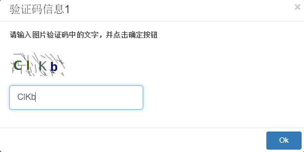

## 服务器API

### askInput

`askInput`可以用在有人值守RPA自动化中。某些情况下，有人值守的RPA自动化脚本需要在执行过程中，提取用户的一些输入，以便继续执行后继的脚本。`askInput` API能执行这样测操作。askInput显示对话框，请求用户输入信息，然后RPA脚本可以继续它的执行。

下面是API的定义:

```javascript
export async function askInput(inquiry: InputInquiryInfo): Promise<any>
```

它接收参数inquiry，返回用户输入的结果的Promise或在等待时间结束时返回缺省值的Promise。参数inquiry有下面的结构:

```javascript
interface InputInquiryInfo {
    title?: string,
    message: string,
    prompt?: string,
    defaultValue: string,
    base64Image?: string,
    waitSeconds: number
}

```

调用askInput传递文字或图片的参数，它在执行时将参数显示在相关界面上。如果在设计器中执行，会直接作为对话框弹出。

下面是askInput 函数参数的描述：

* **title**：可选项，显示提示标题
* **message**：提示消息
* **prompt**：可选项，输入框在没有输入时候显示的信息
* **defaultValue**：可选项，输入框预先设置的缺省值
* **base64Image**：可选项，base64编码的图片文件
* **waitSeconds**：可选项，对话框等待时间，如果设置了，askInput就会在等待时间结束后返回，如果不设置会永久等待。

其中：
* 为获得base64Image所需的base64编码的图片，在Selenium web自动化中，可直接调用[driver.takeScreenshot()](https://seleniumhq.github.io/selenium/docs/api/javascript/module/selenium-webdriver/index_exports_WebElement.html)；在Windows自动化中，可调用测试对象的[takeScreenshot()](/node_api/shared_api.md#takeScreenshots)。如果从文件中读取，可以调用fs.readFileSync读取内容到buffer，再调用`buf.toString('base64')`转换成base64字符串。
* waitSeconds参数可结合defaultValue一起使用，设置缺省值和等待时间，如果用户响应了，返回用户设置的值，如果用户没有在设置时间间隔内响应，返回缺省值。

下面提供了函数的样例代码：

```javascript
    const { askInput } = require('leanrunner');

    (async function () {
        let inquiry = {
            title: '验证码信息1',
            message: '请输入图片验证码中的文字，并点击确定按钮', //required
            prompt: '输入验证码文字',
            defaultValue: 'CIKb',
            base64Image: 'iVBORw0KGgoAAAANSUhEUgAAAF4AAAAmCAIAAADCwbuVAAACS0lEQVR42tWaMW7DMAxFOXTo0FsU6GFygg5Ftw5divb+gxPAReCKEvX5SUluoCGwI5l6/iIpKrIt+nz/fG3n/sjCGZ6cjrSMRlpwhkRHo0s6aIm/88nCqXbZL+bSkZTVdBSRa9qcCtJvDfQ1xpvsXrQn07rrvU7QkbjwWnRA67vmtgARdGajIRaUl473ESl0JMtpadNxbePmVulkaeqMaOLBZQSdNDSaDuJEErOSlOU2Cg0x22l0CJEmoyFSwZTUEaRTPMt+IoTm5e1ZN9u+y+vD3k5FR++BeDRVKAgdF5rC+svH+94qwzau03HNoCPGWAWFYpRcNMfxW2i6XB6fPveG0+mjqXqpQh0utWs0eMCqokH0YqCx6VRtk2rovX3RCyeIBqej0YDryEZjJxzaNmmB1A5lAppfF/4XDe5fImgcvmYEGjC/OKJx+d0jmvv3LqkcNHjpLwWNNx4dcRSNoMOrxhaREaG6GXCBhlDNnQVIJ4rGtRMBgze4oCK+hhZOH02LjguNa6dXdcN0hMJ9c2GMGCW7JWh0hMLpLEBTBeTKhv8FmsIesW3N2kO5KpJGNkxsFIhkB0JjAEpZUDgam84+CB2heDRcrQwM9jga45ZG48prUDTdQgY4VRoNV/27/YzLhqeqxiiscRVv16vKOt4dtaDukY5DswXOqnDhL/Y1NJpq4dKFxlucTiub00eO9FNAOmB9s1s8H4tm8x/ddZ1I4oG/PWb+YQuY8npH0M4rBY0x5iQ0kYiDFCvjdFaqhvjviNEr/Z9rutcVYxT9LFz5RWAAAAAASUVORK5CYII=',
            waitSeconds: 30
    }
    let inputString = await askInput(inquiry);
    console.log('get input', inputString);
})();
```

在设计器中执行时会显示如下对话框:



如果在LeanRunner服务器上执行，会显示类似的界面：


服务器可让多用户通过浏览器访问，只有启动执行的用户通过浏览器登录才能收到该对话框的通知。如果多个脚本并发执行，或脚本中调用了多次askInput，所有的请求信息会依据时间顺序显示在服务器上。

例如下面，脚本调用了多次askInput，服务器上就会收到多次这样的通知：


### getServerConfig

getServerConfig用于获取服务器端的某些配置数据的信息。在RPA执行时，有些数据需要放在服务器端，便于修改和保存。例如，登录某个网站的用户名和密码可能需要经常变化，并且不能泄露，这类敏感数据不适宜放在脚本代码中。因此可以在服务器端维护，脚本执行的时候动态从服务器端获取。也可以有些其它类型的动态配置数据，例如，代理服务器，用于数据驱动脚本的数据等。

函数具有如下的定义：

```javascript
function getServerConfig<T>(configName: string, defaultValue: T): Promise<T>;

```

在LeanRunner设计器中执行这个API不会访问服务器，只会直接返回第二个参数值，即缺省值。如果没有缺省值，会直接返回null。

在LeanRunner服务器触发的脚本执行这个API会访问LeanRunner服务器。

下面是样例代码：

```javascript
let { getServerConfig } = require('leanrunner');
async function getProxies() {
    let config = await getServerConfig('proxies', { 'default': '112.64.53.107:4275' })
    console.log('server config', JSON.stringify(config));
    return config
}
```

getProxies函数调用getServerConfig API从服务器获取代理服务器列表。

例如在LeanRunner服务器上配置了下面的Proxy:


那么上面的代码样例会返回下面JSON的Promise:

```json
{
    "临时Proxy1": "http://192.168.0.4:8081",
    "长期Proxy1": "http://192.168.0.18:1080"
}

```

然后用户可枚举返回的代理服务器，选择一个需要的。