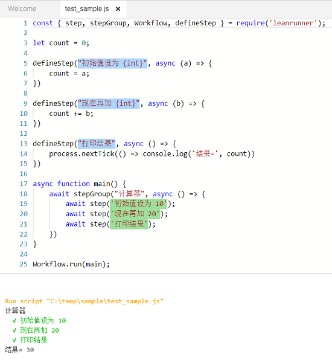

# 流程框架API

LeanRunner提供一组流程框架API，用来驱动RPA脚本的执行。框架API分为两类，[流程控制API](#workflow_api)和[平台API](server_api.md)。

框架API在名为“leanrunner”的执行库中。下面是引入该库的样例，请根据需要引入合适的API。


```javascript
const { step, scenario, Workflow, askInput } = require('leanrunner');
```

<a id="workflow_api">

## 流程控制API

流程控制API（简称流程API）用来在脚本中设置流程步骤和场景，通过流程API，可以用自然语言描述步骤及场景，将执行流程及结果以更加可读的方式展现出来。

### 1. defineStep （步骤定义）

defineStep定义了一个可复用的流程步骤定义，它包括两个参数：可匹配的步骤描述模板，和步骤函数。它的定义如下：


```javascript
function defineStep(pattern: string, code: StepDefinitionCode): void

```

当定义了一个步骤定义后，它可以通过`step` API以不同的参数调用。

我们来举例说明，样例为：

```javascript
const { step, scenario, Workflow, defineStep } = require('leanrunner');

let count = 0;

defineStep("初始值设为 {int}", async (a) => {
    count = a;
})

defineStep("现在再加 {int}", async (b) => {
    count += b;
})

defineStep("打印结果", async () => {
    process.nextTick(() => console.log('结果=', count))
})

async function main() {
    await scenario("计算器", async () => {
        await step('初始值设为 10');
        await step('现在再加 20');
        await step('打印结果');
    })
}

Workflow.run(main);
```

这个样例中，调用了3次defineStep定义了三个步骤定义函数，它们分别用来处理“初始值”，“加数”和“打印结果”三个步骤，其中初始值（被加数）和加数的步骤各定义了一个为**int**类型的参数，参数会自动解析出来传递给函数（"a"和"b")，并在函数中使用。

在`main`流程的执行中，只需用`step` 函数并传递文字描述，就会自动调用这些步骤定义，得到执行结果。

下面展示的是代码在LeanRunner编辑器中的显示，以及输出结果，如下图：



在图片下面的输出结果中，可以看到执行了计算，并打印出实际结果。因为步骤的成功执行信息是在步骤函数执行完才打印，我们调用了"process.nextTick", 让结果的输出在步骤文本的输出之后显示。

此外在代码编辑器中，可以看到步骤定义的文本模板是淡蓝色背景的而步骤文本是浅绿色的。这样可以更容易区分步骤和步骤定义。

步骤定义的文本是遵循"Cucumber Expression"格式，更多详情可以参考 [Cucumber Expression](https://cucumber.io/docs/cucumber/cucumber-expressions/)。

### 2. step （步骤）

step作为流程API，定义了一个流程步骤。它包含一个或两个参数，下面分别讨论这两种情形：

1. 一个参数

   ```javascript
    async step(title: string);
   ```

   一个参数时，它会直接调用跟这个步骤文本匹配的流程步骤定义，使用跟这个步骤文本匹配的步骤定义来执行。步骤和步骤定义的匹配请参考"Cucumber Expression"。下面两种情形会导致错误：

   1. 有多个步骤定义匹配同一个步骤文本
   2. 没有步骤定义匹配这个文本

   这两种情况下，框架都无法确定该使用哪一个步骤定义来执行这个步骤。

2. 两个参数

   两个参数时，它包括步骤文本和步骤函数：

   ```javascript
    async step(title: string, action: async (world: World) => Promise<void>);
   ```

   这时，它不会尝试查找匹配的步骤定义，而是直接执行第二个函数参数。

   由于大多数自动化操作现在都是异步的，因此`step` API和step的函数参数是异步的，其他工作流API也是如此。 这意味着为了使多个step调用按顺序运行，您应该“await”每个步骤调用。

### 3. scenario （场景）

scenario函数定义了一个流程场景。它包含场景的标题和一个函数，函数内部可以调用多个步骤(step)函数。

```javascript
   async scenario(title: string, group: async () => Promise<void>)
```

### 4. run （执行流程）

`step`和`scenario`都是流程API，属于Workflow对象，同时也提供了直接调用的方法，即不带“Workflow.”前缀。

另一个属于Workflow的方法为`run`，它可以运行一个函数作为流程。函数中可以有多个`step`和`scenario`的调用。

### 流程API的作用

流程API可以在执行过程中报告执行到的步骤，这些信息记录在以.json.log为后缀的执行日志中，可以用来分析执行的流程、间隔时间，错误信息等。除描述信息以外，可以为每个执行步骤添一个或多个附件，附件包括：

1. 文本内容
2. JSON内容
3. 图片内容

这些信息内容可以显示在最终的执行报告中。在设计器环境下，流程报告的内容可以在下面方式中显示：
1. 执行项目时，会生成*.json.log文件，这是包含json内容的输出日志，可用来在设计器或服务器中生成html或其它格式的报告
1. 执行项目时，当作为项目执行时，通过翻译*.json.log文件生成html报告，并且在项目执行完成后，在新窗口中显示报告。它可以同时显示步骤信息和所有的附件，此外还有所有场景和步骤的统计信息。
2. 执行单个js脚本文件，或执行项目时步骤信息会显示在设计器的输出面板中，但这时候没有图片附件


