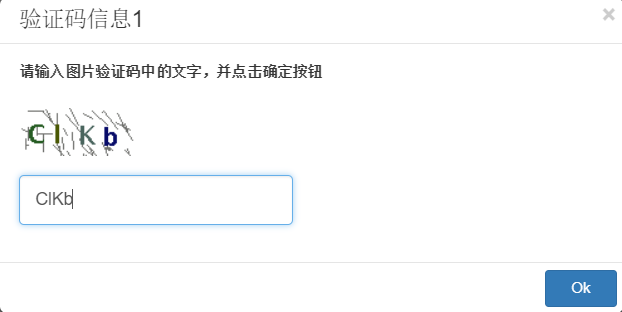

# 框架API

LeanRunner提供一组框架API，用来驱动RPA脚本的执行流程。

框架API在名为“leanrunner”的执行库中。下面是引入该库的样例，请根据需要引入合适的API。


```javascript
const { step, stepGroup, Workflow, askInput } = require('leanrunner');
```

## 流程控制API

流程控制API（简称流程API）用来在脚本中设置流程步骤和场景，通过流程API可视化，

### step

step作为流程API，定义了一个流程步骤。它包含步骤文本和步骤函数。

```javascript
   async step(title: string, action: async (world: World) => Promise<void>)
```

### stepGroup

stepGroup函数定义了一个流程场景。它包含场景的标题和一个函数，函数内部可以调用多个步骤(step)函数。

```javascript
   async stepGroup(title: string, group: async () => Promise<void>)
```


### askInput

askInput显示请求用户输入信息。下面是API的定义

```javascript
export async function askInput(inquiry: InputInquiryInfo): Promise<any>

interface InputInquiryInfo {
    title?: string,
    message: string,
    prompt?: string,
    defaultValue: string,
    base64Image?: string,
    waitSeconds: number
}

```

有些情况下，有人值守的RPA自动化脚本需要在执行过程中，提取用户的一些输入，以便继续执行后继的脚本。*askInput* API能执行这样测操作。

调用它，传递文字或图片的参数，它在执行时将参数显示在相关界面上。如果在设计器中执行，会直接作为对话框弹出。

下面是askInput 函数参数的描述：

* title: 可选项，显示提示标题
* message：显示图片
* prompt：可选项，输入框在没有输入时候显示的信息
* defaultValue: 可选项，输入框预先设置的缺省值
* base64Image：可选项，base64编码的图片文件
* waitSeconds：可选项，对话框等待时间，如果设置了，askInput就会在等待时间结束后返回，如果不设置会永久等待。

其中，waitSeconds参数可结合defaultValue一起使用，设置缺省值和等待时间，如果用户相应了，返回用户设置的值，如果用户没有在设置时间间隔内响应，返回缺省值。

下面提供了函数的样例代码：

```javascript
    let inquiry = {
        title: '验证码信息1',
        message: '请输入图片验证码中的文字，并点击确定按钮', //required
        prompt:'输入验证码文字',
        defaultValue: 'CIKb',
        base64Image: 'iVBORw0KGgoAAAANSUhEUgAAAF4AAAAmCAIAAADCwbuVAAACS0lEQVR42tWaMW7DMAxFOXTo0FsU6GFygg5Ftw5divb+gxPAReCKEvX5SUluoCGwI5l6/iIpKrIt+nz/fG3n/sjCGZ6cjrSMRlpwhkRHo0s6aIm/88nCqXbZL+bSkZTVdBSRa9qcCtJvDfQ1xpvsXrQn07rrvU7QkbjwWnRA67vmtgARdGajIRaUl473ESl0JMtpadNxbePmVulkaeqMaOLBZQSdNDSaDuJEErOSlOU2Cg0x22l0CJEmoyFSwZTUEaRTPMt+IoTm5e1ZN9u+y+vD3k5FR++BeDRVKAgdF5rC+svH+94qwzau03HNoCPGWAWFYpRcNMfxW2i6XB6fPveG0+mjqXqpQh0utWs0eMCqokH0YqCx6VRtk2rovX3RCyeIBqej0YDryEZjJxzaNmmB1A5lAppfF/4XDe5fImgcvmYEGjC/OKJx+d0jmvv3LqkcNHjpLwWNNx4dcRSNoMOrxhaREaG6GXCBhlDNnQVIJ4rGtRMBgze4oCK+hhZOH02LjguNa6dXdcN0hMJ9c2GMGCW7JWh0hMLpLEBTBeTKhv8FmsIesW3N2kO5KpJGNkxsFIhkB0JjAEpZUDgam84+CB2heDRcrQwM9jga45ZG48prUDTdQgY4VRoNV/27/YzLhqeqxiiscRVv16vKOt4dtaDukY5DswXOqnDhL/Y1NJpq4dKFxlucTiub00eO9FNAOmB9s1s8H4tm8x/ddZ1I4oG/PWb+YQuY8npH0M4rBY0x5iQ0kYiDFCvjdFaqhvjviNEr/Z9rutcVYxT9LFz5RWAAAAAASUVORK5CYII=',
        waitSeconds: 30
    }
    let inputString = await askInput(inquiry);
```

在设计器中执行时会显示如下对话框:



如果在LeanRunner服务器上执行，会显示类似的界面：


服务器可让多用户通过浏览器访问，只有启动执行的用户通过浏览器登录才能收到该对话框的通知。如果多个脚本并发执行，或脚本中调用了多次askInput，所有的请求信息会依据时间顺序显示在服务器上。

例如下面，脚本调用了多次askInput，服务器上就会收到多次这样的通知：


### 流程API的作用

流程API可以在执行过程中报告执行到的步骤，这些信息记录在执行日志中，可以用来分析执行的流程、间隔时间，错误信息等。除描述信息以外，可以为每个执行步骤添一个或多个附件，附件包括：

1. 文本内容
2. JSON内容
3. 图片内容

这些信息内容可以显示在最终的执行报告中。在设计器环境下，流程报告的内容可以在下面方式中显示：
1. 执行项目时作为html报告中，这时候可以同时显示步骤信息和所有的附件，此外还有所有场景和步骤的统计信息
2. 执行单个js脚本文件，或执行项目时步骤信息会显示在设计器的输出面板中，但这时候没有图片附件


