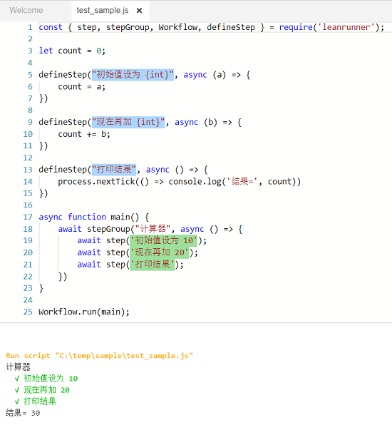
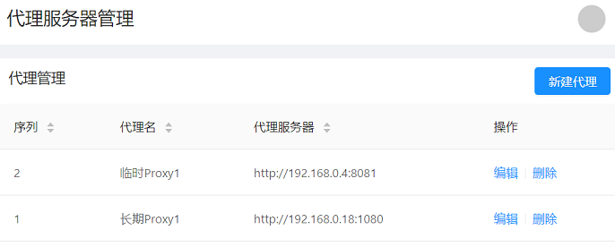

# 框架API

LeanRunner提供一组框架API，用来驱动RPA脚本的执行。框架API分为两类，**流程控制API**和**平台API**。

框架API在名为“leanrunner”的执行库中。下面是引入该库的样例，请根据需要引入合适的API。


```javascript
const { step, stepGroup, Workflow, askInput } = require('leanrunner');
```

## 流程控制API

流程控制API（简称流程API）用来在脚本中设置流程步骤和场景，通过流程API，可以用自然语言描述步骤及场景，将执行流程及结果以更加可读的方式展现出来。

### 1. defineStep （步骤定义）

defineStep定义了一个可复用的流程步骤定义，它包括两个参数：可匹配的步骤描述模板，和步骤函数。它的定义如下：


```javascript
function defineStep(pattern: string, code: StepDefinitionCode): void

```

当定义了一个步骤定义后，它可以通过`step` API以不同的参数调用。

我们来举例说明，样例为：

```javascript
const { step, stepGroup, Workflow, defineStep } = require('leanrunner');

let count = 0;

defineStep("初始值设为 {int}", async (a) => {
    count = a;
})

defineStep("现在再加 {int}", async (b) => {
    count += b;
})

defineStep("打印结果", async () => {
    process.nextTick(() => console.log('结果=', count))
})

async function main() {
    await stepGroup("计算器", async () => {
        await step('初始值设为 10');
        await step('现在再加 20');
        await step('打印结果');
    })
}

Workflow.run(main);
```

这个样例中，调用了3次defineStep定义了三个步骤定义函数，它们分别用来处理“初始值”，“加数”和“打印结果”三个步骤，其中初始值（被加数）和加数的步骤各定义了一个为**int**类型的参数，参数会自动解析出来传递给函数（"a"和"b")，并在函数中使用。

在`main`流程的执行中，只需用`step` 函数并传递文字描述，就会自动调用这些步骤定义，得到执行结果。

下面展示的是代码在LeanRunner编辑器中的显示，以及输出结果，如下图：



在图片下面的输出结果中，可以看到执行了计算，并打印出实际结果。因为步骤的成功执行信息是在步骤函数执行完才打印，我们调用了"process.nextTick", 让结果的输出在步骤文本的输出之后显示。

此外在代码编辑器中，可以看到步骤定义的文本模板是淡蓝色背景的而步骤文本是浅绿色的。这样可以更容易区分步骤和步骤定义。

步骤定义的文本是遵循"Cucumber Expression"格式，更多详情可以参考 [Cucumber Expression](https://cucumber.io/docs/cucumber/cucumber-expressions/)。

### 2. step （步骤）

step作为流程API，定义了一个流程步骤。它包含一个或两个参数，下面分别讨论这两种情形：

1. 一个参数

   ```javascript
    async step(title: string);
   ```

   一个参数时，它会直接调用跟这个步骤文本匹配的流程步骤定义，使用跟这个步骤文本匹配的步骤定义来执行。步骤和步骤定义的匹配请参考"Cucumber Expression"。下面两种情形会导致错误：

   1. 有多个步骤定义匹配同一个步骤文本
   2. 没有步骤定义匹配这个文本

   这两种情况下，框架都无法确定该使用哪一个步骤定义来执行这个步骤。

2. 两个参数

   两个参数时，它包括步骤文本和步骤函数：

   ```javascript
    async step(title: string, action: async (world: World) => Promise<void>);
   ```

   这时，它不会尝试查找匹配的步骤定义，而是直接执行第二个函数参数。

   由于大多数自动化操作现在都是异步的，因此`step` API和step的函数参数是异步的，其他工作流API也是如此。 这意味着为了使多个step调用按顺序运行，您应该“await”每个步骤调用。

### 3. stepGroup （场景）

stepGroup函数定义了一个流程场景。它包含场景的标题和一个函数，函数内部可以调用多个步骤(step)函数。

```javascript
   async stepGroup(title: string, group: async () => Promise<void>)
```

### 4. run （执行流程）

`step`和`stepGroup`都是流程API，属于Workflow对象，同时也提供了直接调用的方法，即不带“Workflow.”前缀。

另一个属于Workflow的方法为`run`，它可以运行一个函数作为流程。函数中可以有多个step和stepGroup的调用。

### 流程API的作用

流程API可以在执行过程中报告执行到的步骤，这些信息记录在以.json.log为后缀的执行日志中，可以用来分析执行的流程、间隔时间，错误信息等。除描述信息以外，可以为每个执行步骤添一个或多个附件，附件包括：

1. 文本内容
2. JSON内容
3. 图片内容

这些信息内容可以显示在最终的执行报告中。在设计器环境下，流程报告的内容可以在下面方式中显示：
1. 执行项目时，会生成*.json.log文件，这是包含json内容的输出日志，可用来在设计器或服务器中生成html或其它格式的报告
1. 执行项目时，当作为项目执行时，通过翻译*.json.log文件生成html报告，并且在项目执行完成后，在新窗口中显示报告。它可以同时显示步骤信息和所有的附件，此外还有所有场景和步骤的统计信息。
2. 执行单个js脚本文件，或执行项目时步骤信息会显示在设计器的输出面板中，但这时候没有图片附件


## 平台API

### askInput

`askInput`可以用在有人值守RPA自动化中。某些情况下，有人值守的RPA自动化脚本需要在执行过程中，提取用户的一些输入，以便继续执行后继的脚本。`askInput` API能执行这样测操作。askInput显示对话框，请求用户输入信息，然后RPA脚本可以继续它的执行。

下面是API的定义:

```javascript
export async function askInput(inquiry: InputInquiryInfo): Promise<any>
```

它接收参数inquiry，返回用户输入的结果的Promise或在等待时间结束时返回缺省值的Promise。参数inquiry有下面的结构:

```javascript
interface InputInquiryInfo {
    title?: string,
    message: string,
    prompt?: string,
    defaultValue: string,
    base64Image?: string,
    waitSeconds: number
}

```

调用askInput传递文字或图片的参数，它在执行时将参数显示在相关界面上。如果在设计器中执行，会直接作为对话框弹出。

下面是askInput 函数参数的描述：

* **title**：可选项，显示提示标题
* **message**：提示消息
* **prompt**：可选项，输入框在没有输入时候显示的信息
* **defaultValue**：可选项，输入框预先设置的缺省值
* **base64Image**：可选项，base64编码的图片文件
* **waitSeconds**：可选项，对话框等待时间，如果设置了，askInput就会在等待时间结束后返回，如果不设置会永久等待。

其中：
* 为获得base64Image所需的base64编码的图片，在Selenium web自动化中，可直接调用[driver.takeScreenshot()](https://seleniumhq.github.io/selenium/docs/api/javascript/module/selenium-webdriver/index_exports_WebElement.html)；在Windows自动化中，可调用测试对象的[takeScreenshot()](/node_api/shared_api.md#takeScreenshots)。如果从文件中读取，可以调用fs.readFileSync读取内容到buffer，再调用`buf.toString('base64')`转换成base64字符串。
* waitSeconds参数可结合defaultValue一起使用，设置缺省值和等待时间，如果用户响应了，返回用户设置的值，如果用户没有在设置时间间隔内响应，返回缺省值。

下面提供了函数的样例代码：

```javascript
    let inquiry = {
        title: '验证码信息1',
        message: '请输入图片验证码中的文字，并点击确定按钮', //required
        prompt:'输入验证码文字',
        defaultValue: 'CIKb',
        base64Image: 'iVBORw0KGgoAAAANSUhEUgAAAF4AAAAmCAIAAADCwbuVAAACS0lEQVR42tWaMW7DMAxFOXTo0FsU6GFygg5Ftw5divb+gxPAReCKEvX5SUluoCGwI5l6/iIpKrIt+nz/fG3n/sjCGZ6cjrSMRlpwhkRHo0s6aIm/88nCqXbZL+bSkZTVdBSRa9qcCtJvDfQ1xpvsXrQn07rrvU7QkbjwWnRA67vmtgARdGajIRaUl473ESl0JMtpadNxbePmVulkaeqMaOLBZQSdNDSaDuJEErOSlOU2Cg0x22l0CJEmoyFSwZTUEaRTPMt+IoTm5e1ZN9u+y+vD3k5FR++BeDRVKAgdF5rC+svH+94qwzau03HNoCPGWAWFYpRcNMfxW2i6XB6fPveG0+mjqXqpQh0utWs0eMCqokH0YqCx6VRtk2rovX3RCyeIBqej0YDryEZjJxzaNmmB1A5lAppfF/4XDe5fImgcvmYEGjC/OKJx+d0jmvv3LqkcNHjpLwWNNx4dcRSNoMOrxhaREaG6GXCBhlDNnQVIJ4rGtRMBgze4oCK+hhZOH02LjguNa6dXdcN0hMJ9c2GMGCW7JWh0hMLpLEBTBeTKhv8FmsIesW3N2kO5KpJGNkxsFIhkB0JjAEpZUDgam84+CB2heDRcrQwM9jga45ZG48prUDTdQgY4VRoNV/27/YzLhqeqxiiscRVv16vKOt4dtaDukY5DswXOqnDhL/Y1NJpq4dKFxlucTiub00eO9FNAOmB9s1s8H4tm8x/ddZ1I4oG/PWb+YQuY8npH0M4rBY0x5iQ0kYiDFCvjdFaqhvjviNEr/Z9rutcVYxT9LFz5RWAAAAAASUVORK5CYII=',
        waitSeconds: 30
    }
    let inputString = await askInput(inquiry);
```

在设计器中执行时会显示如下对话框:


如果在LeanRunner服务器上执行，会显示类似的界面：


服务器可让多用户通过浏览器访问，只有启动执行的用户通过浏览器登录才能收到该对话框的通知。如果多个脚本并发执行，或脚本中调用了多次askInput，所有的请求信息会依据时间顺序显示在服务器上。

例如下面，脚本调用了多次askInput，服务器上就会收到多次这样的通知：


### getServerConfig

getServerConfig用于获取服务器端的某些配置数据的信息。在RPA执行时，有些数据需要放在服务器端，便于修改和保存。例如，登录某个网站的用户名和密码可能需要经常变化，并且不能泄露，这类敏感数据不适宜放在脚本代码中。因此可以在服务器端维护，脚本执行的时候动态从服务器端获取。也可以有些其它类型的动态配置数据，例如，代理服务器，用于数据驱动脚本的数据等。

函数具有如下的定义：

```javascript
function getServerConfig<T>(configName: string, defaultValue: T): Promise<T>;

```

在LeanRunner设计器中执行这个API不会访问服务器，只会直接返回第二个参数值，即缺省值。如果没有缺省值，会直接返回null。

在LeanRunner服务器触发的脚本执行这个API会访问LeanRunner服务器。

下面是样例代码：

```javascript
let { getServerConfig } = require('leanrunner');
async function getProxies() {
    let config = await getServerConfig('proxies', { 'default': '112.64.53.107:4275' })
    console.log('server config', JSON.stringify(config));
    return config
}
```

getProxies函数调用getServerConfig API从服务器获取代理服务器列表。

例如在LeanRunner服务器上配置了下面的Proxy:



那么上面的代码样例会返回下面JSON的Promise:

```json
{
    "临时Proxy1": "http://192.168.0.4:8081",
    "长期Proxy1": "http://192.168.0.18:1080"
}

```

然后用户可枚举返回的代理服务器，选择一个需要的。

