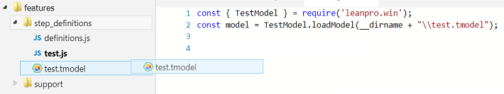
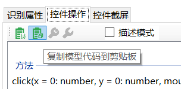
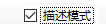
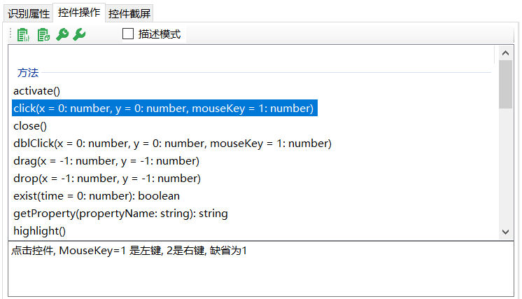
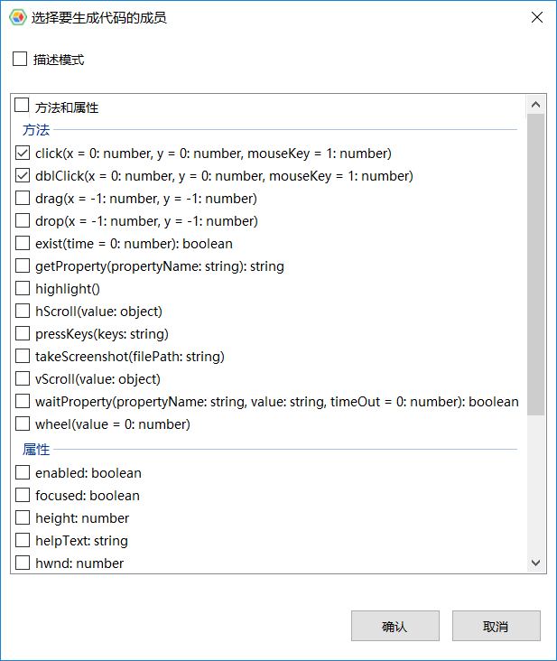

# 代码生成和运行

## 生成模型加载代码
对象模型保存后是以（*.tmodel）为后缀的文件。在自动化脚本中，如要使用这个模型，需要加载模型。模型管理器可以生成加载模型的代码，这样避免了手动键入这部分代码。有两者方式生成模型加载代码：

1. 直接将模型文件从文件浏览面板拖拽到代码编辑器中：

   

   将生成加载该模型的代码。

2. 模型管理器中，点击右边“控件操作” ，切换到方法面板，点击下图的按钮，自动将全局加载代码方法拷贝到粘贴板。

   

   打开代码编辑器，粘贴代码。

会生成如下类似的代码：


   ```javascript
      const { TestModel } = require("leanpro.win");
      var model = TestModel.loadModel("C:\\temp\\vbtest\\BuildYourOffice.tmodel");
   ```

## 模型依赖代码和描述模式代码

模型管理器可生成两种类型的代码：
* **模型依赖代码**：这类代码是需要加载模型的，调用语句通过名称寻找模型中的对象。
例如下面的语句，从模型中寻找“SimpleStyles”Window对象，然后在这个父对象下面找“Normal1”CheckBox对象，找到后点击这个Checkbox

```javascript
   await model.getWindow("SimpleStyles").getCheckBox("Normal1").click();
```

* **描述模式代码**：描述模式是指被测对象的属性信息都在代码中描述。
如果勾选描述模式框 ，之后生成的代码就是描述模式代码，否则就是模型依赖代码。

## 生成元素控件编辑代码
下面介绍三种生成代码的方法。

### 方法1：拖拽方法名

1. 点击“控件操作”面板中的其中一个方法，选中项的背景色为蓝色。
 
2. 拖拽选中的方法或属性到编辑器中，自动生成代码

### 方法2：复制/粘贴

1.	选中方法，点击按钮，会自动将生成代码复制到粘贴板中，
2.	打开你正在使用的编辑器，粘贴代码。

### 方法3：拖拽{{book.test_object}}
还有一种方法，就是将对象模型树中的节点直接拖拽到您的编辑器中（需要编辑器支持文本拖拽）。当拖拽完成时，会自动打开一个对话框，显示您拖拽{{book.test_object}}支持的所有方法，如下图：



您勾选您要的方法调用，点击确认，这些调用代码就放置到正在编辑文件的对应位置。在这个对话框上也能选择是否生成描述模式代码。
