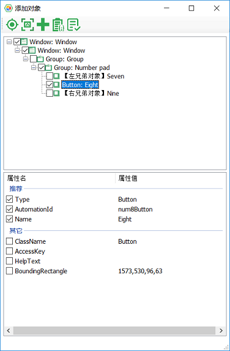
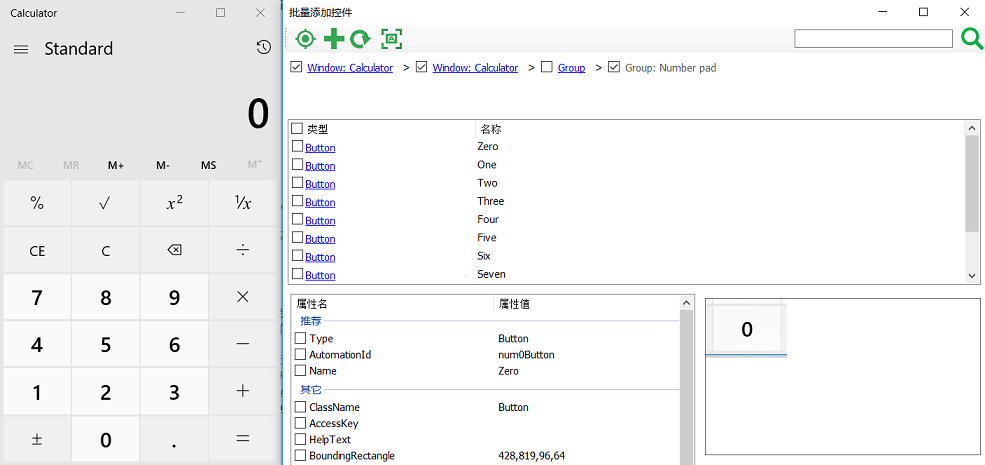
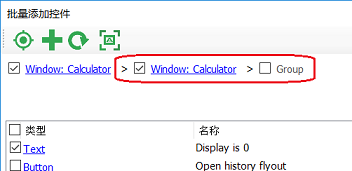

# 侦测控件及对象添加

模型管理器提供了多种方式，识别一个或多个控件，并添加到应用模型中：

1. 添加对象
2. 批量添加控件
3. 侦测器(Spy)

这三种方式分别针对工具条上的三个按钮：

## 1. 添加对象

用于识别单个控件对象，并加入到对象模型中(Object Model)。

当点击“添加对象”，模型管理器会隐藏，这样用户可以在屏幕上用鼠标左键点击要添加的的控件。模型管理器会侦测到控件，并显示下面对话框：

其中：
* 上半部的树形结构中所要包含的控件元素，选择那些在识别中对控件层次化识别有帮助的节点。其中，模型管理器已经自动帮用户做了一些选择，比如，那些只是作为容器，但不包含内容的panel控件缺省没有被选中。
* 用户选中的控件会作为叶子节点显示在树上，并列显示的还有它在控件树形结构的左控件和右控件。因为有比较大的可能性左边和右边的控件也会需要。如需要用户可以也勾选它们。
* 每个节点用于唯一标识这个控件的属性。例如AutomationId，通常被开发人员设成唯一标识控件的常量值，如果是的话就可以只选AutomationId。否则，如果ClassName + Name属性可以唯一标识控件，也可以选这两个。Type属性为必选。

## 2. 批量添加控件

当需要侦测的控件很多时，逐个侦测并添加控件会很繁琐。点击菜单中的 ”批量添加控件“，可以成批添加控件。方法是在模型管理器的工具条上点击按钮，模型管理器窗口会隐藏，您可以在应用上选择想要添加的某个控件，选中之后就会弹出“批量添加控件”窗口，界面如下图：

例如针对“计算器”应用，选取一个按钮控件，模型管理器会识别所有在同一层次与这个按钮相邻的控件，并显示在列表中。上图中间部分的列表控件显示了与你点击按钮同一层次的所有控件。可以勾选其中控件的复选框。对于每个控件，还可以勾选修改推荐的识别属性。最后点击添加按钮，将它们批量添加到模型中。
如果发现侦测的控件不是你真正想添加的，可以通过最顶端的面包屑导航条定位到其它的层次控件。导航条列出的是当前列表控件的所有父控件，是从最顶层的窗体控件一级一级往下，直到当前你点击控件的层次。
如果列表中的控件是一个容器，包含了其它子控件，那么点击它的蓝色链接部分会进一步打开这个容器，然后在列表中显示下一级的直接子控件。但是如果它没有子控件，点击它的链接部分则没有反应。
当你在中间的控件列表中点击不同行的时候，右下角的图片框会显示这个控件的截图，这样用户可以清楚的看出需要添加的是哪个控件。

### 2.1 控件搜索

在批量添加中，可对控件做搜索。在搜索框中填入文本，搜索当前面包屑控件下所有层次的对象。填入的文本会用来匹配控件类型和控件名称。例如在下图中，为了在Calculator中搜索所有的文本控件，在搜索框中输入"text"并点击搜索，会在列表框中显示所有Calculator中出现的文本控件：

这时你可以选中需要的Text控件，并将它添加到模型中。

需要注意的是，通过搜索直接添加的对象是直接出现在选中的面包屑控件下，没有包含中间层次的控件。如果需要中间层次控件信息作为定位的，请点击你需要的控件链接，这时会出现所有的层次。例如当在上图中点击"Display is 0"控件，这时在面包屑控件中会出现所有它的父元素层次：

这时你就可以选择在初次搜索中没有出现的父控件。

## 3. 侦测器(Spyer)

当你需要在被测应用上查看多个控件并添加时，可以使用侦测器查看，并添加。侦测器可始终显示在桌面上，当鼠标在桌面上移动时，会高亮鼠标所在点位置的控件。如果是需要添加的，可点击鼠标左键停止侦测。这时再点击侦测器上的添加按钮，将侦测到的控件添加到模型中。

## 其它技巧

当你要添加的控件不是直接在界面上可见，需要通过几次点击后才能显示时，可以通过按住Ctrl键完成前几次点击，最后在需要添加的控件出现时，释放Ctrl，点击鼠标左键后即可添加。

一个典型的场景是菜单控件，如果要添加子菜单，可在菜单控件上按住Ctrl，并打开菜单，菜单显示后，点击子菜单前释放Ctrl并长点左键，就可添加子菜单项到模型中。

