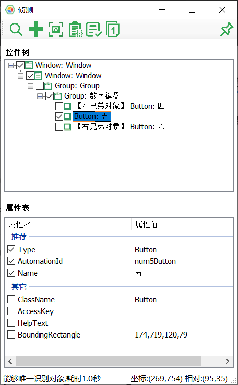
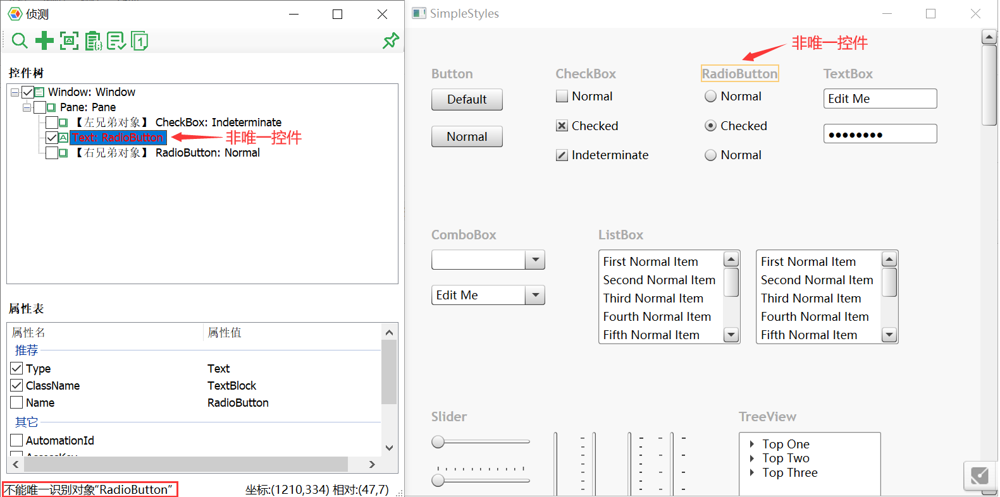
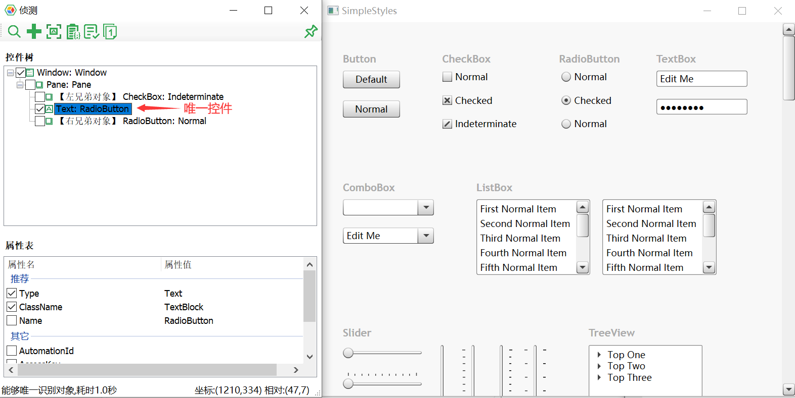
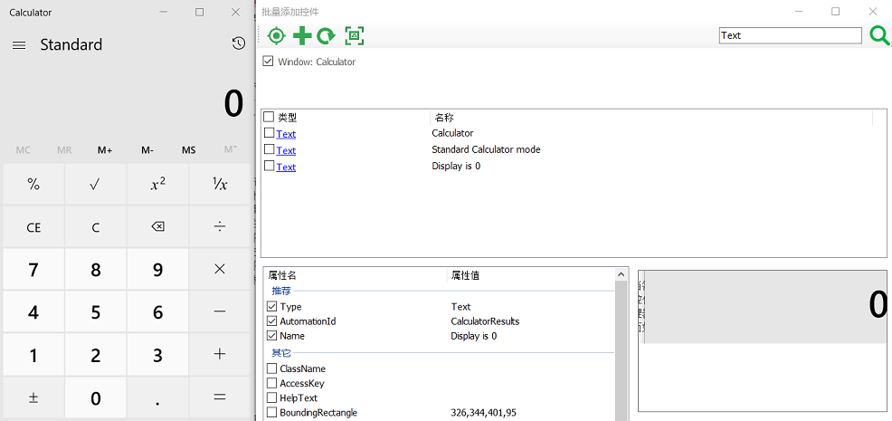

# 侦测控件及对象添加

模型管理器提供了多种方式，识别一个或多个控件，并添加到应用模型中：

1. 添加对象
2. 批量添加控件
3. 侦测器(Spy)

这三种方式分别针对工具条上的三个按钮：

## 1. 添加对象

用于识别单个控件对象，并加入到对象模型中(Object Model)。

当点击“添加对象”，模型管理器会隐藏，这样用户可以在屏幕上用鼠标左键点击要添加的的控件。模型管理器会侦测到控件，并显示下面对话框：

其中：
* 上半部的树形结构中所要包含的控件元素，选择那些在识别中对控件层次化识别有帮助的节点。其中，模型管理器已经自动帮用户做了一些选择，比如，那些只是作为容器，但不包含内容的panel控件缺省没有被选中。
* 用户选中的控件会作为叶子节点显示在树上，并列显示的还有它在控件树形结构的左控件和右控件。因为有比较大的可能性左边和右边的控件也会需要。如需要用户可以也勾选它们。
* 每个节点用于唯一标识这个控件的属性。例如AutomationId，通常被开发人员设成唯一标识控件的常量值，如果是的话就可以只选AutomationId。否则，如果ClassName + Name属性可以唯一标识控件，也可以选这两个。Type属性为必选。

  

### 控件唯一性验证

在识别到控件后，会自动验证控件的唯一性。同时如果用户应用程序界面有变化，也可以手动点击 验证唯一性。

如果验证不唯一，在用户添加对象到模型中时，会提示是否要添加索引使其唯一识别。如果需要唯一识别，用户可以点击“**自动添加索引**”按钮为不能唯一识别的对象添加索引值。

唯一性验证配合“**自动添加索引**”功能可以快速向模型添加唯一识别对象。

  

#### 自动唯一性验证

在侦测到控件后，会自动验证控件的唯一性。如果用户重新勾选需要的对象和识别属性时，其唯一性都也有可能变化，因此也会自动重新验证唯一性。
在添加控件阶段会自动的进行唯一性验证并将不能唯一识别控件的对象标红。它提高在添加控件阶段更精准的添加需要的控件，唯一性验证会在以下几种情况中自动的触发：

- 侦测控件完成时；
- 树结构修改对象勾选时；
- 增删识别属性时；

当目标控件唯一性验证完成后，可以在侦测面板下方的提示是否能唯一识别的信息。同时也能看到**耗时**，它显示的是从顶层对象逐层侦测到最下层对象所花费的时间。一般来说，层级越多，匹配的越精确、耗时也越久、但也可能有例外情况。这个时间也是实际脚本执行时需要的侦测时间。因此在保证精确性的前提下，根据耗时的显示，适当的调整父节点数量、调整识别属性，使耗时最少，这样能够提高控件在实际操作时的性能。

唯一性验证过程中会在状态条上显示“取消”链接。如果不需要继续验证，可以点击它取消唯一性验证。

#### 手动唯一性验证

在用户应用程序界面有变化时需要手动点击“控件唯一性验证”按钮。如果控件可以被唯一识别，会红框闪烁高亮控件，如果不能被唯一识别，控件会显示橙色的框。

当目标控件无法通过唯一性验证时，会以红色标识出该控件所在树中不唯一的父节点（可以理解为标识出控件识别在哪一级开始出现歧义）；并且会在应用中使用橙色高亮框标识控件，如下图。

  

  

  

### 添加索引值(index)

在控件无法通过唯一性验证时，可以通过添加索引值(index)属性来解决。当对象匹配到多个控件时，返回匹配控件列表中的第`index`个控件。默认为0，即第一个匹配控件。

使用“添加索引值”按钮将自动的为红色节点添加`index`值，从而使其唯一。

添加index后会重新验证唯一性，可能仍然有其它红色节点，可以重复点击“添加索引值”步骤直至整个对象链条能够唯一定位需要的控件。 

需要注意的是，“index”属性并非控件固有属性，而是控件在父结构中或控件搜索结果中的排列顺序，因此可能随着控件布局的变化而变化。如果你发现你的被自动化应用的控件布局可能有动态变化，请选择避免用index属性。

## 2. 批量添加控件

当需要侦测的控件很多时，逐个侦测并添加控件会很繁琐。点击菜单中的 ”批量添加控件“，可以成批添加控件。方法是在模型管理器的工具条上点击按钮，模型管理器窗口会隐藏，您可以在应用上选择想要添加的某个控件，选中之后就会弹出“批量添加控件”窗口，界面如下图：

例如针对“计算器”应用，选取一个按钮控件，模型管理器会识别所有在同一层次与这个按钮相邻的控件，并显示在列表中。上图中间部分的列表控件显示了与你点击按钮同一层次的所有控件。可以勾选其中控件的复选框。对于每个控件，还可以勾选修改推荐的识别属性。最后点击添加按钮，将它们批量添加到模型中。
如果发现侦测的控件不是你真正想添加的，可以通过最顶端的面包屑导航条定位到其它的层次控件。导航条列出的是当前列表控件的所有父控件，是从最顶层的窗体控件一级一级往下，直到当前你点击控件的层次。
如果列表中的控件是一个容器，包含了其它子控件，那么点击它的蓝色链接部分会进一步打开这个容器，然后在列表中显示下一级的直接子控件。但是如果它没有子控件，点击它的链接部分则没有反应。
当你在中间的控件列表中点击不同行的时候，右下角的图片框会显示这个控件的截图，这样用户可以清楚的看出需要添加的是哪个控件。

### 2.1 控件搜索

在批量添加中，可对控件做搜索。在搜索框中填入文本，搜索当前面包屑控件下所有层次的对象。填入的文本会用来匹配控件类型和控件名称。例如在下图中，为了在Calculator中搜索所有的文本控件，在搜索框中输入"text"并点击搜索，会在列表框中显示所有Calculator中出现的文本控件：

这时你可以选中需要的Text控件，并将它添加到模型中。

需要注意的是，通过搜索直接添加的对象是直接出现在选中的面包屑控件下，没有包含中间层次的控件。如果需要中间层次控件信息作为定位的，请点击你需要的控件链接，这时会出现所有的层次。例如当在上图中点击"Display is 0"控件，这时在面包屑控件中会出现所有它的父元素层次：

这时你就可以选择在初次搜索中没有出现的父控件。

## 3. 侦测器(Spyer)

当你需要在被测应用上查看多个控件并添加时，可以使用侦测器查看，并添加。侦测器可始终显示在桌面上，当鼠标在桌面上移动时，会高亮鼠标所在点位置的控件。如果是需要添加的，可点击鼠标左键停止侦测。这时再点击侦测器上的添加按钮，将侦测到的控件添加到模型中。

## 其它技巧

当你要添加的控件不是直接在界面上可见，需要通过几次点击后才能显示时，可以通过按住Ctrl键完成前几次点击，最后在需要添加的控件出现时，释放Ctrl，点击鼠标左键后即可添加。

一个典型的场景是菜单控件，如果要添加子菜单，可在菜单控件上按住Ctrl，并打开菜单，菜单显示后，点击子菜单前释放Ctrl并长点左键，就可添加子菜单项到模型中。

