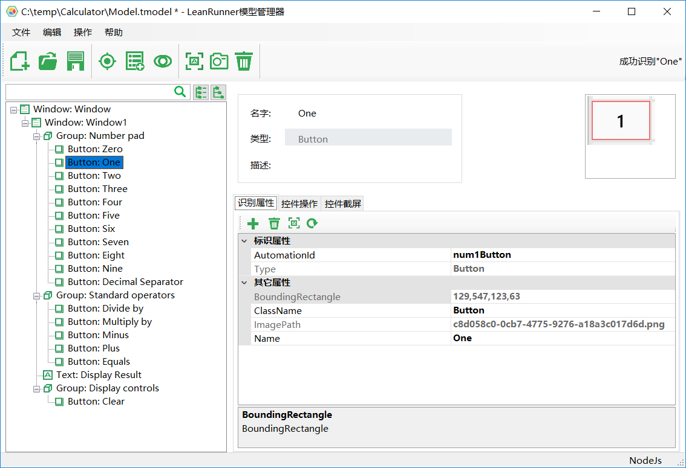
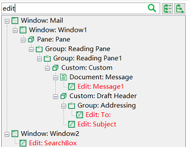
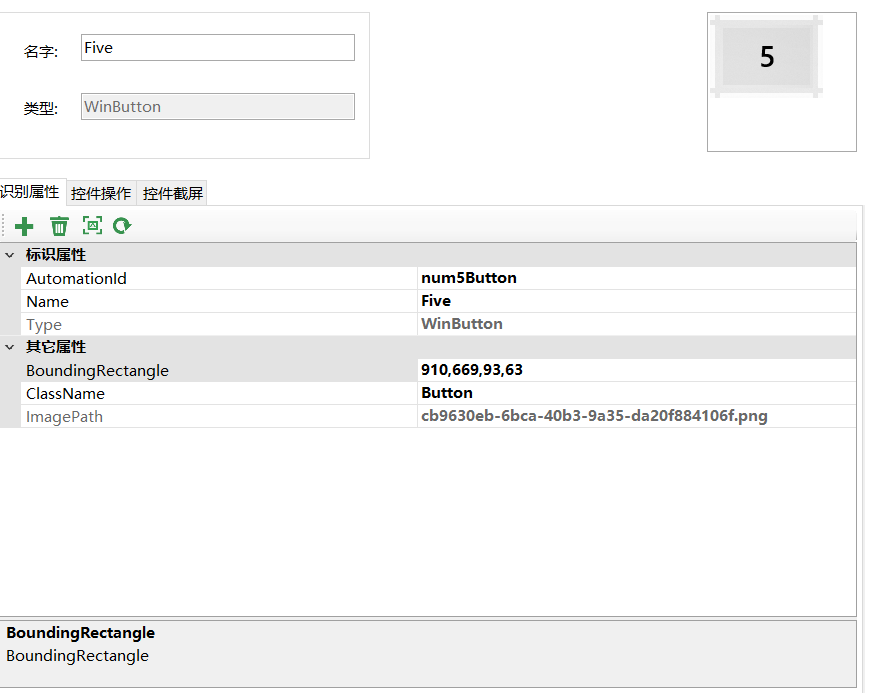
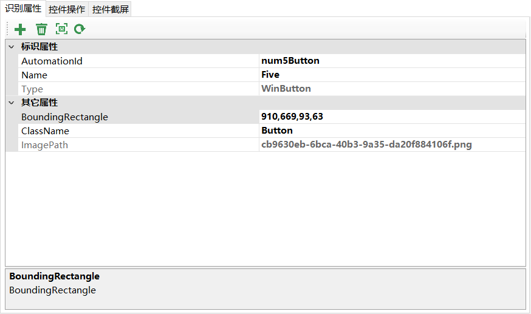
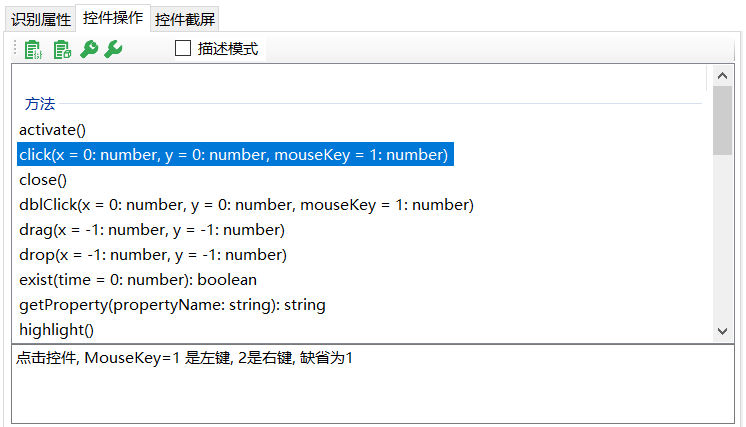

# 模型管理器\(Model Manager\)概述

模型管理器\(MM\)用来管理Windows应用控件对象的树状结构，它存储了测试对象，用于识别对象，以及截获控件的快照等。因为该组件提供在CukeTest\(自动化测试产品）及LeanRunner\(RPA自动化产品）中，在不同的产品中界面功能稍有不同，阅读帮助文档时请结合上下文理解。

MM可以对测试对象的信息做各种编辑，调整它们的顺序。对象添加到模型后，用户可以在树状结构中拖动。MM支持多语言（包括中文和英文）当应用的语言设置后，重新打开模型管理器可生效。

MM包含了多种的侦测方式，具体方式请参见[侦测控件及对象添加](control_spy.md)

测试对象\(Test Object\)包含了控件对象的属性信息，可以用于定位对象。 下图是模型管理器的界面：

## 测试模型树

模型管理器左边部分是测试模型树，显示了测试对象的树状结构，顶部是搜索控件，在搜索控件中输入文本，用来过滤控件，会显示所有匹配的控件以及它们的父控件。匹配逻辑会用输入的文本去匹配控件的名称、类型和它们的属性值。如果是这些值的子串，就会当作结果显示。搜索框右边的两个按钮 是用来展开整个树状结构，或是折叠整个树。 例如下图显示了搜索文本“edit”时，搜索结果过滤的情况。匹配的对象都以红色标出：

## 节点编辑面板

当点击对象树的任意一个节点，则在左边的面板中会显示这个测试对象的属性，如下图： 

* 上半部分左边是显示控件的名称和类型，名称可以由用户自由修改，不会影响控件的识别，只是用来给用户区分控件。类型是指这个控件的类型，是只读属性不能修改。
* 上半部分部分右边显示控件的截屏，是在侦测控件时获取的。

  下一节介绍这个面板上的几个标签页：

### 1. 识别属性页

下半部分第一个标签页显示了测试对象的属性，当前元素控件相关属性。

* 为当前元素添加新的“识别属性”：属性必须为已经识别到的保存在“其它属性”属性，或者Index属性。当其它属性不能唯一标识对象时，Index属性可以从中选取第n个对象。Index属性从0开始。
* 删除当前元素的属性：选中属性，再点击这个按钮执行删除。请注意，在标识属性上点删除并不会直接删除属性，而是把这个属性放到了“其它属性”栏。因为有可能下次你需要再把它重新设为标识属性。只有对“其它属性”点删除才会将这个属性从这个对象上真正删掉。
* 高亮这个测试对象，前提是应用程序打开，并能识别到这个对象。
* 从应用中重新更新测试对象的属性。针对应用程序已经更新，测试对象已经不匹配的情况，您可以点击这个按钮，然后选择新的应用中对应这个测试对象的控件，模型管理器会从这个控件中重新生成测试对象，并把属性更新到当前这个测试对象中。注意，这个操作有一个约束，就是您这次选择的控件必须和上次选择的是同一类控件，如果控件类型变化，例如从RadioButton变成了CheckBox，则您不能用这种方法更新控件，需要添加新的测试对象对应新的控件。

### 2. 控件操作页

提供此测试对象运行时可以进行操作的方法。

*  选中方法，自动将方法代码拷贝到粘贴板中。
*  将整个元素模型加载方法拷贝到粘贴板中。

  每个测试对象有多个操作方法和属性，不同类型的对象则可能有一些同样的方法属性，并有自己独特的属性方法。

  方法：选中某个元素，模型管理器会自动将此元素支持的操作方法罗列出来，鼠标点击具体方法，最下边信息栏显示具体描述。

在模型管理器中，可对控件的某些方法直接调用，测试它在被测应用上的效果。有两种调用方式“调用缺省”和“调用…”：

*  调用缺省按钮，针对没有参数的方法、属性、或是所有参数都有缺省值的情况。
*  会弹出一个对话框，用于输入方法参数，针对有参数的方法。

### 3. 控件截屏页

显示在识别该控件时截取的控件图片。

