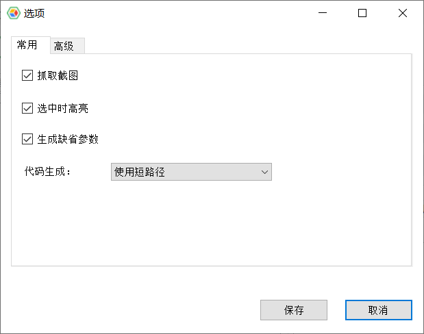
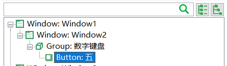

# 对象模型管理器配置

对象模型管理器中点击“操作”=>“选项”，会打开配置界面，如下:



其中的选项包括：

### 抓取截图
设置在添加对象到模型时，是否自动抓取控件的截屏，存储在模型中。截图可增强模型的可读性，查看对象时更直接的知道是对应哪个控件。但截图在回放的时候不会使用。

### 选中时高亮
当模型中左边树形栏中选中一个对象时，是否同时在被自动化的应用上高亮对应的控件。

### 编程语言
对象模型管理器可生成多种语言的调用代码，这个选项控制生成哪个语言的代码。注意这个选项在CukeTest或LeanRunner Lite中是禁用的，因为该版本支持node.js。

### 使用内置代码编辑器
对象模型管理器内置了一个简易的脚本编辑调试器。可在需要的时候打开编辑并测试自动化代码。

### 代码生成
当为一个对象生成调用时，是使用短路径还是长路径。

使用短路径，即在生成代码时，直接使用要操作的对象名来获取对象，而不包含父对象的调用，例如

对于计算器上的按钮“5”，对象库有如下的对象结构：

对于计算器上的按钮“5”，对象库有如下的对象结构：

生成短路径的代码如下：
```javascript
model.getButton("五").click();
```
生成全路径的代码如下：
```javascript
model.getWindow("Window1").getWindow("Window2").getGeneric("数字键盘").getButton("五").click();
```
两者有类似的效果，短路径的方式更简洁，但是用户需要确保这个对象的名称在模型库中是唯一的。

###其它配置
并非所有配置都通过配置界面设置。有些非常用配置可直接用文本编辑器编辑配置文件(CukeTest 为".cuketest.json"，LeanRunner为".leanrunner.json")

* **SnapshotMargin**: 该配置项在管理器中为对象截屏的外边缘宽度，缺省为10，例如，你可以设置一个更宽的值，以便在需要在控件外部定义虚拟控件时可以选择合适的区域。

修改配置文件需要重启模型管理器使配置生效。

