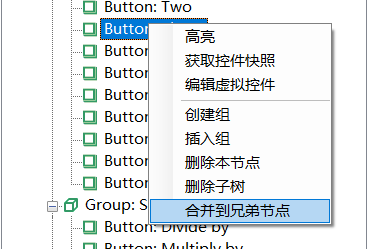
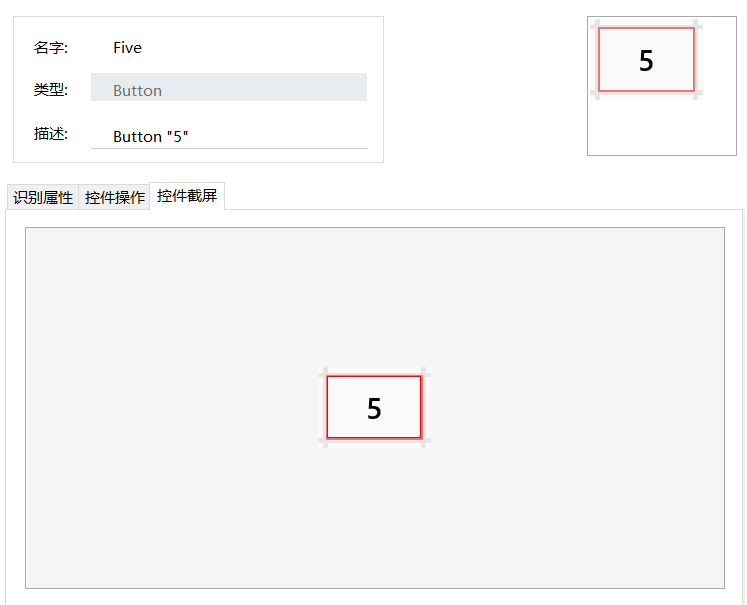

# 测试对象操作

模型管理器中的树形结构中显示了模型中的对象，对于每个对象节点，有下列相关的操作：

* 高亮
* 获取控件快照
* 编辑虚拟控件
* 创建组
* 插入组
* 删除本节点
* 删除子树
* 合并到兄弟节点
* 上移和下移

## 高亮 

在被测应用上高亮这个测试对象对应的控件，前提是应用程序打开，并能识别到这个对象。

高亮也可在工具条上点击。在元素树形结构中，选中对象，点击高亮图标，被测应用上面对应元素高亮显示，元素识别成功。工具条右边也会显示识别成功与否。

## 获取控件快照 

显示对应控件的截屏信息。这个截屏和它上面的截屏缩略图是一样的，提供在这里是为了有些比较大的控件，能够更好的看清控件的全貌。

## 编辑虚拟控件 

虚拟控件通过将某个界面的某个区间定义为控件，可以实现更细粒度的控制。更多内容参见[虚拟控件](virtual_control.md)

## 创建组  

组是用来将多个控件分类管理而引入的。它在运行时对用户是透明的。“创建组”会在某个控件下创建一个子控件。

## 插入组  

在某个控件的父级插入一个组对象。

## 删除本节点  

只删除该选中对象。删除后，它的所有子对象成为它父对象的子对象。

## 删除子树  

删除该对象及所有子对象

## 合并到兄弟节点 

有些对象自动添加到模型中时，引入了重复的父对象。可在重复对象的根节点上执行这个操作，将重复对象级联地合并到跟它重复的对象。模型管理器会递归的合并子对象，直到某一级上没有可合并的重复对象为止。合并的前提是两个对象有相同的识别属性。

## 上移和下移  

上移即将该节点向上移动，即与同一级别的前一个对象交换顺序，如果已经是第一个节点则位置不变。

下移即将该节点向下移动，即与同一级别的后一个对象交换顺序，如果已经是最后一个节点则位置不变。

