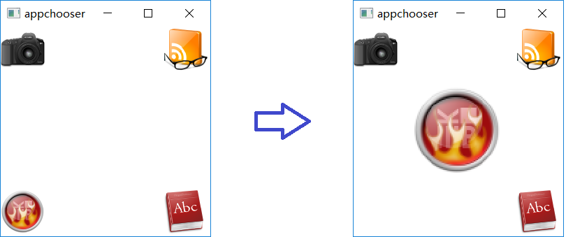
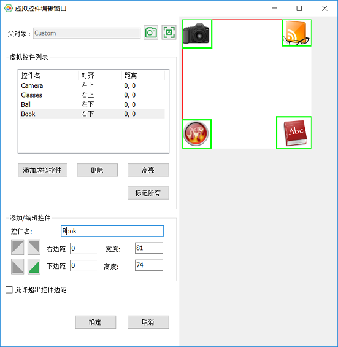
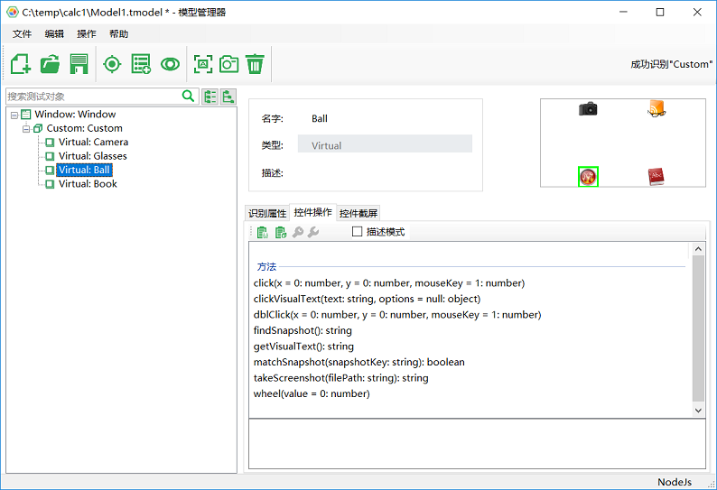

# 虚拟控件(Virtual Control)


虚拟控件是通过将某个界面的某个区间定义为一个逻辑的控件。它可以实现以下功能：
* 调用文字识别（OCR）的方法，通过图像的方式获得文字内容或者操作文字区域。
* 进行图片比对。
* 更细粒度的控制。例如某些应用有自绘制的界面，其中的某些按钮是非标准的控件，无法通过识别对象加到模型中。一种对它的操作方法是计算鼠标点击位置。用位置坐标的参数控制它的点击。但是这种点击方法有缺陷：
   1. 代码的可读性差
   2. 当窗体可拉伸情况下，有效点击坐标位置是变化的。

  使用虚拟控件可以避免以上的缺陷

下面通过实例，介绍虚拟控件在模型管理器的定义。虚拟控件的API的说明请参见[虚拟控件API](/node_api/virtual_api.md)。

在QT中的动画演示样例程序appchooser中有下面的界面。



左图是打开时候的界面，当点击其中的某个图标，图标会放大居中。

为了自动化这个应用，可先识别这个窗体控件，然后在Panel上点右键，选择编辑虚拟控件，并打开虚拟控件对话框：



这里：
1. 添加4个虚拟控件，分别命名为Camera、Glass、Ball、Book
2. 为这些控件在图片上选择对应的区域
3. 选择对齐的方式。例如Book控件选择的是靠右下对齐，这样，当窗体伸缩时，虚拟控件仍旧在右下角对应的位置点击这个图标。
4. 点击确定保存这些虚拟控件。

回到模型编辑器界面：



可以看到：
* 虚拟控件在父控件(Panel)中的位置
* 虚拟控件的方法，包括click、dblClick、wheel。

为虚拟控件生成代码后如下:

```javascript
//Node.js code:
model.getVirtual("Camera").click();

```

可以看到调用非常简洁。

虚拟控件的API的说明请参见[虚拟控件API](/node_api/virtual_api.md)


