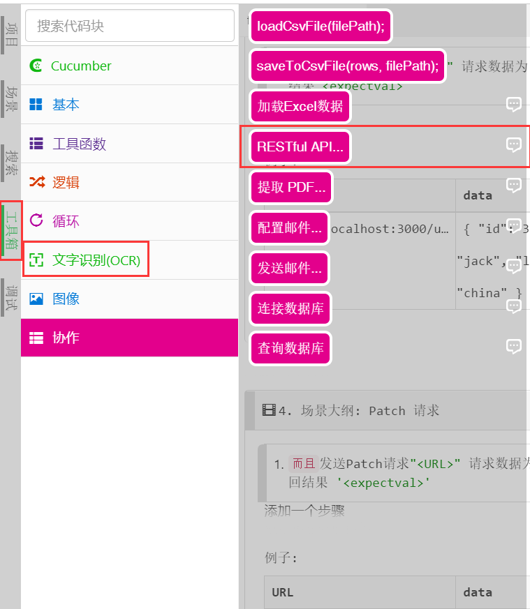
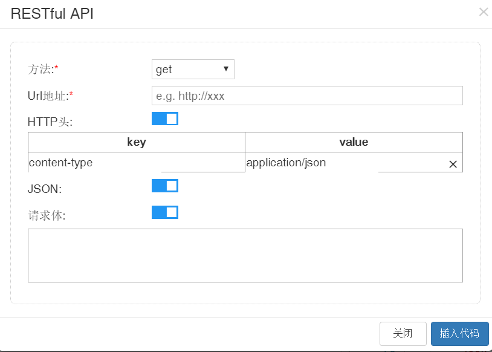

# API自动化库-got

进行API自动化，可供选择的npm库有很多，{{book.product}}内置了比较流行的`got`库和生成API调用代码的工具箱，因此无需特意安装包就可以进行API的自动化。

产品提供了`got`库的简单封装，封装后的库命名为`leanpro.got`，以避免命名冲突。您可以点击这个命名查看这个库的类型文件。下面提供了这个库的简单使用说明。如果需要更详细的文档，可以查看[got官方文档](https://www.npmjs.com/package/got/v/9.6.0)。

### HTTP库——Got的使用

使用下面这行代码引入内置的用于发起HTTP请求库——`got`：

```js
const got = require('leanpro.got');
```  

使用`got`库访问API很简单，也很符合直觉，分为三个部分：HTTP请求方法、API链接，以及配置项option。常见的有两种：

1. 第一种：使用HTTP请求对应的对应的方法：
   
   ```js
   got.get(url, [options]);
   got.post(url, [options]);
   got.put(url, [options]);
   got.delete(url, [options]);
   ......
   ```

2. 第二种：将HTTP请求方式写入到配置项`options`中：

   ```js
   let options = {
      method: "GET" [| "POST" | "PUT" | "DELETE" |... ],
    ......
   }
   got(url, options);
   ```

为了保证代码的可读性，这里推荐使用的是第一种方法。

#### 配置项options

配置项`options`控制所有的请求动作发起的细节，如重试次数、超时时间、代理、HTTP协议等等。由于`got`库的`options`的属性时是按照node.js原生的`https.request`库来设计的，因此配置的内容除了可以查看[options说明文档](https://www.npmjs.com/package/got/v/9.6.0#goturl-options)，还可以查看[https.request文档](https://nodejs.org/api/https.html#https_https_request_options_callback)。

> 出于稳定性的考虑，{{book.product}}中使用的是`9.6.0`版本的`got`，因此文档也选择了相应版本的。如果您需要其它版本，您可以独立安装`got`库。

### API代码工具箱

当然除了自己动手写配置外，你还可以选择{{book.product}}工具箱提供的代码生成窗口，在左侧“工具栏”->“协作”->“RESTful API”中，工具如下所示：

   

  

将工具拖拽到编辑器中，通过简单的配置，就会在该区域生成相应的代码。工具提供了常用的`get`、`post`、`put`、`delete`四种方法，另外两种方法可以直接修改代码使用。在API工具界面我们可以看到提供了几个选项：

- 方法：可选的有`get`、`post`、`put`、`delete`四种方法；
- Url地址：API的链接，注意不要遗漏`http://`或者`https://`的前缀，尽管不加该前缀工具也能自动识别并区分，但是建议是手动加上；
- HTTP头：即HTTP的请求头，具体内容可以参照[HTTP Headers](https://developer.mozilla.org/zh-CN/docs/Web/HTTP/Headers)。默认为POST请求头的`content-type`属性提供了默认值`application/json`目标API接受JSON的形式的请求体`body`；
- JSON：通常保持默认打开即可，打开后接受json格式的请求体(`body`)传入；
- 请求体：HTTP的请求内容，在API测试中通常为JSON格式的数据。


如果您想用不同版本的got库，您可以用npm直接安装：例如：`npm install got`可以安装最新版本的got库，它可能与内置的`leanpro.got`功能略有不同。