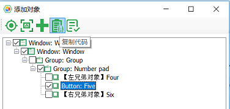
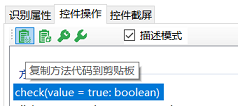
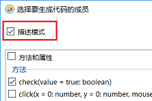

## 描述模式

描述模式是一种直接在代码中通过属性构造{{book.test_object}}的方式，它区别于通过对象模型方式加载{{book.test_object}}的方式。

描述模式从"leanpro.win"中输出的"Auto"对象开始调用"get[ControlType]"方法，例如Auto.getWindow()、Auto.getButton()等。"get[ControlType]"方法接收一个对象，包含属性的集合，这些属性以"AND"的关系构造一个{{book.test_object}}，用来查找控件。

在下面的例子中的代码，可以直接从属性直接构造测对象，而不用加载对象模型：
  
   ```javascript
    const { Auto } = require('leanpro.win');

    Auto.getWindow({
       "className": "ApplicationFrameWindow",
       "title": "计算器 ‎- 计算器"
    }).getWindow({
       "className": "Windows.UI.Core.CoreWindow",
       "title": "计算器"
    }).getGeneric({
       "type": "Group",
       "automationId": "NumberPad",
       "name": "数字键盘"
    }).getButton({
       "automationId": "num5Button"
    }).click();
   ```

上述例子中，每个调用都是传一个对象参数，这个对象包含了多个键/值对，组合在一起后形成过滤条件寻找对象。
  
描述模式调用"get[ControlType]"方法返回的对象具有与对象模型中获取的对象有相同的方法和属性，因此其它的调用方式相同。

描述模式的优点是无需依赖对象模型，可以动态构建{{book.test_object}}，或根据需要访问界面上动态创建的控件。它的缺点是不能集中的管理{{book.test_object}}，不能使用对象管理器的编辑界面修改或验证{{book.test_object}}，维护代码的开销大。因此可以根据场景的需要使用描述模式。

### 生成代码

描述模式的代码可以手动键入，但通过模型管理器生成则更为方便。下面的一些方式可以生成描述模式的代码：

1. 点击“添加对象”并侦测到一个控件后弹出“添加对象”对话框，这时点击“复制代码”，会将描述模式代码复制到剪贴板中：

   

2. 在{{book.test_object}}编辑界面，勾选“描述模式”，这时候再复制的代码就是描述模式代码。

   
   
3. 将对象直接从对象树拖拽到编辑器时，会弹出方法选择对话框，这时勾选“复制代码”复选框，生成的代码也是描述模式代码。

   
   