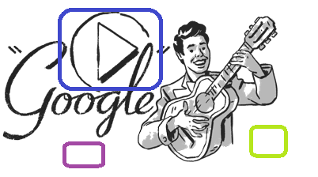
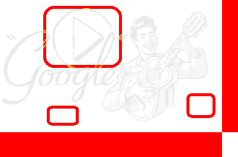
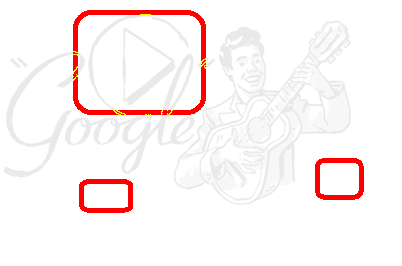

## 图像操作API

图像操作API用于在执行中操作API，及自动化结果的验证，主要通过Image对象。此外虚拟控件也有相应的方法，根据图片实现判断。

#### Image对象

`Image`对象用于获得图片的属性信息，及针对图片的比较操作。

`Image`对象定义如下：

   ```javascript
    class Image {
        width: number;
        height: number;
        
        clip(rect: {x: number, y: number, width: number, height: number}): Image;
        drawImage(image: Image, x: number, y: number): Image;
        getData(option?: {encoding: 'base64' | null}): Promise<Buffer | string>;
        
        static fromData(bufferOrString: Buffer | string): Promise<Image>;
        static fromFile(filePath: string): Promise<Image>;
        
        static imageEqual(image1: Buffer | string | Image,
            image2: Buffer | string | Image, 
            options?: CompareOptions,
            compareInfo?: ImageCompareInfo): Promise<boolean>;
        static imageCompare(image1: Buffer | string | Image,
            image2: Buffer | string | Image, 
            options?: CompareOptions): Promise<ImageCompareResult>
    }
   ```

获得一个Image对象的实例可以得到图片的属性，或将图片用于后继处理。

可以从Buffer、base64的字符串，或者一个文件路径生成Image实例，例如：

   ```javascript
   const { Image } = require('leanpro.visual');
   const fs = require('fs');
   (async function() {
       let buf1 = fs.readFileSync('c:/temp/image1.png');
       let image1 = await Image.fromData(buf1);
       console.log(image1.width, image1.height);
       
       let image2 = await Image.fromFile('c:/temp/image2.png');
       console.log(image2.width, image2.height);
   })()
   ```
   
上面例子分别从Buffer和文件中读取图片数据并打印宽度和高度。

> 注意：无法直接通过new Image()创建对象，需要通过fromData或者fromFile生成Image实例。另外Image对象现只支持PNG格式的图片。

**实例成员：**
 
  * **clip** 用于剪切图片，返回另一个图片。传入矩形框，按照矩形框剪切图片，如果传入数据不合法导致剪切的图片宽度或高度为0，返回为null;
  * **drawImage** 用于将两幅绘制图片绘制到一幅图片上。返回为新绘制的图片。
  
  例如：
   ```javascript
     this.screen1 = await model.getButton("Five").takeScreenshot();
     this.screen2 = await model.getButton("Six").takeScreenshot();
     let image1 = await Image.fromData(this.screen1);
     let image2 = await Image.fromData(this.screen2);
     
     image1 = image1.clip({ x: 10, y: 10, width: image1.width - 20, height: image1.height - 20 })
     image2 = image2.clip({ x: 10, y: 10, width: image2.width - 20, height: image2.height - 20  })
    
     let combinedImage = image1.drawImage(image2, image1.width + 5, 0);
   ```
   
  上面代码将两个按钮截屏剪切掉10像素的周围边缘，然后绘制到一张图片上，中间间隔5个像素。

  如果你想让两幅图片上下排列，你可以使用类似下面的代码：
  ```javascript
    let combinedImage = image1.drawImage(image2, 0, image1.height + 5);
  ```

  您还可以使用为负值的x，y，以便第二个图像在第一个图像的另一侧绘制，例如，以下语句将在左侧绘制image2，在右侧绘制image1：
  ```javascript
    let combinedImage = image1.drawImage(image2, -(image1.width + 5), 0);
  ```

  * **getData**返回图片的内容数据，可用于保存至文件，或添加到报表中。注意它返回的是Promise，所以在async函数中需要加await。

#### 图片比较操作

在自动化过程中，为了验证结果的正确性，可以通过验证结果图片和期望图片的差异来判断执行结果是否正确。

图片判断主要有两种方式：
* 比较图片差异，返回布尔值。
* 将两幅图对应像素相减，产生结果图片，将差异点用色彩标出来，结果图片显示在报表中，可以由人工判断是否正确。

Image对象的imageEqual和imageCompare分别针对上面两种对比方式。

由于操作系统、分辨率、颜色设置都可能影响图片的显示，同样的控件在不同的环境设置下可能显示不同，所以在比较截屏图片时，一般会设置比较容忍度。在容忍度阈值内认为两幅图片是相同的。容忍度有如下的分类：

* **颜色容忍度**：针对两幅图片的两个对应像素点，如果它们的RGB颜色按照特定的距离算法在一定的范围内认为是相同的。
* **像素容忍度**：针对两幅图整体而言，如果不同的像素点数量在一定的范围内，则认为两幅图是相同的。像素容忍度还可以根据百分比来设定，即不同的点占图片所有像素的百分比。

<a id="imageEqual" />
* **imageEqual**

  imageEqual用来比较两幅图片的差异，返回布尔值的Promise，如果是true表示相同，false表示不同。如果您只想知道两个图像是否不同，请使用此API。 如果您想知道获取显示差异所在位置的结果图像，请使用另一个API `imageCompare`。

  它的函数签名：
    ```javascript
    imageEqual(image1: Buffer | string | Image,
                image2: Buffer | string | Image, 
                options?: CompareOptions,
                compareInfo?: ImageCompareInfo): Promise<boolean>;
    ```

  * image1、image2可以是Buffer、base64的字符串，或者一个Image实例。
  * options用来指定图片比较的参数，它有如下的参数设置：

    ```javascript
    interface CompareOptions {
            colorTolerance?: number,        //default to 0.1
            pixelNumberTolerance?: number,  //no default value
            pixelPercentTolerance?: number, //default 1, means 1% 
            ignoreExtraPart?: boolean       //default to false
        }
    ```

    其中:
      * **colorTolerance**：颜色容忍度，缺省为0.1。一般不用修改。
      * **pixelNumberTolerance**：像素数量容忍度，没有缺省值。
      * **pixelPercentTolerance**：像素百分比容忍度，缺省为1，即1%。例如，两幅图片分别有10000像素，如果允许少于150个像素不同的情况下认为图片相同，则设置为1.5。
      * **ignoreExtraPart**：是否忽略非重叠部分，缺省为false。两幅比较图片可以是不同尺寸，比较时左上角对齐，超出部分会当成是不同的点。如果设成true，则会忽略超出部分。
    
    当pixelNumberTolerance和pixelPercentTolerance有一个超出了设定值（或缺省值）比较就会返回false。如果只需要使用其中一个设定，可以将另一个设定设为比较大的值。例如只需要pixelNumberTolerance，并忽略pixelPercentTolerance，可以把pixelPercentTolerance设成100。

  * 除了返回值表示是否相同外，有时需要知道详细的信息，例如像素尺寸，有多少点不同，不同的点的百分比等，这时可以通过传出compareInfo对象获得相关信息。
    
    compareInfo的类型：

    ```javascript
    interface ImageCompareInfo {
            image1: {
                width: number,
                height: number
            },
            image2: {
                width: number,
                height: number
            }
            diffPixels: number,
            diffPercentage: number
        }
    ```

    使用时，如果compareInfo传入一个空的对象，调用`imageEqual`后compareInfo会填充如上结构的数据。

    下面是调用样例:
    ```javascript
    (async function() {
        try {
            let pngSource = await Image.fromFile(__dirname + '/../source.png');
            let pngTargt = await Image.fromFile(__dirname + '/../target.png');

            let compareInfo = {};
            let isEqual = await Image.imageEqual(pngSource, pngTargt, 
                {pixelNumberTolerance: 300, ignoreExtraPart: true}, compareInfo);
            console.log('isEqual', isEqual, JSON.stringify(compareInfo, null, 2));
        } catch(err) {
            console.log(err)
        }

    })()
    ```

    执行时它传入两个图片，比较是否相同，同时会忽略没有重叠部分。如果不同的像素点超过300个，则返回false，同时它返回了compareInfo的详细数据。打印的内容如下：

    ```javascript
        isEqual false {
        "image1": {
            "width": 375,
            "height": 266
        },
        "image2": {
            "width": 402,
            "height": 224
        },
        "diffPixels": 3502,
        "diffPercentage": 3.3100814760203408
        }
    ```

<a id="imageCompare" />
* **imageCompare**

  impageCompare，比较两者图片，返回详细信息的数据，特别是两幅图片差异部分的图片。如果您想获得显示差异所在位置的结果图像，请使用此API。

  它有如下的签名：
    ```javascript
    imageCompare(image1: Buffer | string | Image,
                image2: Buffer | string | Image, 
                options?: CompareOptions): Promise<ImageCompareResult>
    ```

  * image1、image2可以是Buffer、base64的string，或者一个Image实例。
  * options 的设置与imageEqual的options设置相同。此外，如果ignoreExtraPart是false，对生成的差分图片有影响。如果ignoreExtraPart为false，图片非重叠部分会设置为红色，否则非重叠不设置颜色。

  返回值是名为ImpageCompareResult的结构：

    ```javascript
    interface ImageCompareResult {
            equal: boolean,
            info: ImageCompareInfo,
            diffImage: Image
        }
    ```

  其中:
  * **equal**表示是否根据容忍度设置认为图片相同。
  * **info**的结构与imageEqual的compareInfo结构相同，包括像素尺寸，有多少点不同，不同的点的百分比等。
  * **diffImage**是返回的差分图片的Image对象，相同的像素点以缺省白色表示，不同的点显示为红色。图像中原有的图案会以浅色显示在目标图片中，方便定位差异部分所在的位置。

这两个图片比较API中，imageEqual是imageCompare的封装，为了更直观的返回两个图片是否相等的判断结果。如果只想知道是否相等就用imageEqual，如果除了是否相等外，还想知道更详细的就用imageCompare。

#### 示例

下面是比较两个图片并生成差分图片的样例：

   ```javascript
      (async function() {
        try {
            let pngSource = await Image.fromFile(__dirname + '/../image1.png');
            let pngTargt = await Image.fromFile(__dirname + '/../image2.png');

            let result = await Image.imageCompare(pngSource, pngTargt, {pixelNumberTolerance: 300});
            let diffImage = result.diffImage;
            console.log('resultMeta', JSON.stringify(result.info, null, 2));
            let imageData = await diffImage.getData();
            fs.writeFileSync(__dirname + '/../diff.png', imageData)

        } catch(err) {
            console.log(err)
        }
      })()
   ```

该样例打印出差异信息，并把结果图片保存成文件"diff.png"。

假如我们有下面两幅图片：

image1 (375 * 266) | image2 (402 * 224)
---|---
 | 

  根据参数的不同，可以生成下面的差分图片：

ignoreExtraPart = true | ignoreExtraPart = false
---|---
 | 

  左边是ignoreExtraPart = true的情况，超出部分也标记为红色，右边是ignoreExtraPart = false，忽略了超出部分。
  
  
#### 控件与模型图片比较

Windows自动化中一个常见的场景是，将运行时控件的截屏与模型中的保存的测试对象截屏相比较。这可以通过调用测试对象的modelImage方法获得测试对象的截屏png图片，以base64字符串数据返回。如果模型中该对象没有对应的截屏图片，则返回null。

下面的样例从对象模型中获取按钮对象，同时拿到控件截屏和模型中的截屏，并做对比，将对比信息打印出来，同时将差分图片保存到目录中。

```javascript
const { Image } = require('leanpro.visual');
const fs = require('fs')
const { Image } = require('leanpro.visual');
const { TestModel } = require('leanpro.win');

const model = TestModel.loadModel(__dirname + "\\test.tmodel");

(async function () {
    let five = model.getButton("Five");
    let controlImage = await five.takeScreenshot();
    let modelImage = await five.modelImage();
    let result = await Image.imageCompare(modelImage, controlImage);
    fs.writeFileSync(__dirname + '/diff.png', await result.diffImage.getData());
    //print the diff information
    console.log(result.info)
})();
```

#### 虚拟控件上的图片操作
虚拟控件的图片相关操作有：

* findSnapshot
* matchSnapshot

请参见[虚拟控件API](virtual_api.md)获得相关帮助。
