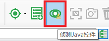
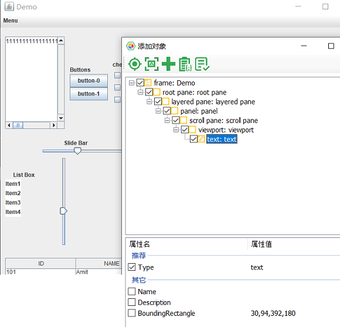

# Java应用自动化

我们的Java自动化依赖于Java Access Bridge。 在进行Java自动化之前，请先在启用Java Access Bridge。

## 启用Java Access Bridge

默认情况下，Java Access Bridge未被启用。 通过命令行或Windows控制面板启用它。 通过运行使用Accessibility API的Java应用程序对其进行测试。

#### 通过命令行启用

通过jabswitch命令启用Java Access Bridge.

运行以下命令（其中%JRE_HOME%是您的JRE目录）：

```
    %JRE_HOME%\bin\jabswitch -enable
```

#### 通过控制面板启用

通过轻松访问中心的控制面板启用Java Access Bridge。

1. 单击“开始”，选择“控制面板”，然后选择“轻松访问”，然后选择“轻松访问中心”。 或者，按Windows徽标键 + U访问“轻松访问中心”。
2. 选择“使用不带显示屏的计算机”。
3. 在“安装的其他程序”部分中，选中“启用Java Access Bridge”复选框（您可能需要向下滚动）。

## 侦测Java控件

在模型管理器上，从工具栏中选择“侦测Java控件”：



然后，您可以从Java应用程序中选择一个控件。 从Java应用程序中单击控件后，将显示侦测对话框，然后可以单击“添加”按钮将其添加到模型中。



您可能会注意到Java对象的图标颜色是橙色，与Windows控件（绿色）不同。

## 调用Java自动化APIs.

为Java控件生成自动化代码的方式类似于Windows控件。

#### Java容器API

容器API是用于获取对象的API，如下所示：

```javascript
interface IJContainer {
    parent: IJContainer;
    getJFrame(...conditions: ConditionFilter[]): IJFrame;
    getJButton(...conditions: ConditionFilter[]): IJButton;
    getJCheckBox(...conditions: ConditionFilter[]): IJCheckBox;
    getRadioButton(...conditions: ConditionFilter[]): IJRadioButton;
    getJEdit(...conditions: ConditionFilter[]): IJEdit;
    getJCustom(...conditions: ConditionFilter[]): IJControl;
}
```

#### Java对象成员

所有的java对象继承于`IJControl`接口:

```javascript
interface IJControl extends IJContainer {
    click(x?: number, y?: number, mousekey?: number): Promise<void>;
    dblClick(x?: number, y?: number, mousekey?: number): Promise<void>;
}
```

而每个特定的对象可能都有自己的控制方法和属性，例如：

```javascript
interface IJCheckBox extends IJControl {
    checkState(): Promise<boolean>
    toggleCheck(checkState: boolean): Promise<void>
}
```

```javascript
interface IJEdit extends IJControl {
    set(value: string): Promise<void>;
    value(): Promise<string>;
}
```

以下是调用Java对象的示例：

* **样例 1:**

   ```javascript
    const { TestModel } = require('leanpro.win');
    const model = TestModel.loadModel(__dirname + '/java_model.tmodel');

    (async function () {
        try {
            await model.java.getJEdit("text1").set('some content');
        } catch(err) {
            console.log('err', err)
        }
    })();

   ```

   为了从模型中获取Java控件，您应该从“model.java”开始调用，该模型将返回根`IJContainer`”`对象，后者又可以从模型中获取其他Java对象。

   当您在Java对象上调用成员，Java对象无法找到匹配的控件时，它将引发“找不到对象”异常。

   如果“ text1”对象可以找到编辑框控件，则它将其内容设置为“some content”。

* **样例 2:**

   以下是一个示例片段，它获取复选框的是否选中状态，并切换其状态为选中选中。

   ```javascript
   (async function () {
        let checkbox = model.java.getJCheckBox('checkbox-0');
        console.log('checked state', await checkbox.checkState());
        await checkbox.toggleCheck(true);
   })();
   ```


