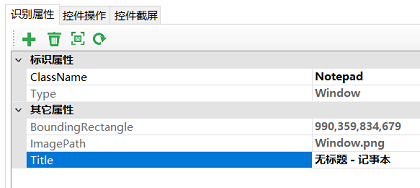

## 获取对象API

获取对象API是那些用于从模型中获取对象的API，或者在描述式编程中通过属性生成对象的API，有如下：


```javascript
export interface IWinContainer {
    parent: IWinContainer;
    getControls(...conditions: ConditionFilter[]): Promise<IWinControl[]>;
    getWindow(...conditions: ConditionFilter[]): IWinWindow;
    getButton(...conditions: ConditionFilter[]): IWinButton;
    getCheckBox(...conditions: ConditionFilter[]): IWinCheckBox;
    getComboBox(...conditions: ConditionFilter[]): IWinComboBox;
    getCustom(...conditions: ConditionFilter[]): IWinCustom;
    getDataItem(...conditions: ConditionFilter[]): IWinControl;
    getDataGrid(...conditions: ConditionFilter[]): IWinDataGrid
    getDocument(...conditions: ConditionFilter[]): IWinDocument;
    getEdit(...conditions: ConditionFilter[]): IWinEdit;
    getGeneric(...conditions: ConditionFilter[]): IWinGeneric;
    getImage(...conditions: ConditionFilter[]): IWinImage;
    getList(...conditions: ConditionFilter[]): IWinList;
    getListItem(...conditions: ConditionFilter[]): IWinListItem;
    getMenuBar(...conditions: ConditionFilter[]): IWinMenuBar;
    getMenuItem(...conditions: ConditionFilter[]): IWinMenuItem
    getMenu(...conditions: ConditionFilter[]): IWinMenu;
    getPane(...conditions: ConditionFilter[]): IWinPane;
    getRadioButton(...conditions: ConditionFilter[]): IWinRadioButton;
    getScrollBar(...conditions: ConditionFilter[]): IWinScrollBar;
    getSlider(...conditions: ConditionFilter[]): IWinSlider;
    getTab(...conditions: ConditionFilter[]): IWinTab;
    getTabItem(...conditions: ConditionFilter[]): IWinTabItem;
    getTable(...conditions: ConditionFilter[]): IWinTable;
    getTree(...conditions: ConditionFilter[]): IWinTree;
    getTreeItem(...conditions: ConditionFilter[]): IWinTreeItem;
    getText(...conditions: ConditionFilter[]): IWinText;
    getVirtual(...conditions: ConditionFilter[]): IWinVirtual
}

```

其中：

### parent
返回父容器对象。

### getControls
返回容器对象数组。它能够根据传入的条件，实时获得应用上所有匹配的控件，并返回对象数组的Promise。该API可以用于有界面多个相似控件的时候，同时返回这一组对象，以便于对所有这些对应控件进行操作。

getControls常用于以下场景：

#### 1. 打开了多个应用实例，寻找其中的一个

例如，你打开了多个Notepad应用，每个在编辑不同的文件，你要找到其中的一个做后继的操作。可以在模型中添加Notepad窗体的对象，如下图：



注意我们已经把`Title`属性从标识属性中删除，以便匹配不同的对象。

然后运行下面的Node.js代码

```javascript
(async function() {
    let controls = await model.getControls("Notepad");
    controls.map(async (control) => console.log(await control.name()));
    let firstNodePad = controls[0];
    await firstNodePad.activate()
})()
```
这段代码会获得所有的Notepad窗口，并打印他们的标题，并将第一个窗口激活显示在前面。

##### 2. 有一组控件，进行集合操作
例如界面上有一组CheckBox控件，需要将它们都选中。以自带样例SimpleStyles为例：
  
  

1. 为了将上面所有的checkbox都标记为选中，可以先加入如下的模型对象：

  

  注意"Name"属性已经从标识属性中删除以匹配所有CheckBox对象。

2. 在`getControls`调用中使用该对象，

```javascript
(async function() {
    let controls = await model.getControls("Normal");
    console.log('controls', controls.length) //匹配控件数量
    for(let control of controls) {
        console.log(await control.name()); //打印checkbox名称
        await control.check(); //勾选checkbox控件
    }
})()
```

### get[ControlType]

其中，针对每个控件类型都提供了一个方法，该方法返回这种类型控件的测试对象。例如，Button控件可以通过`getButton`方法获得，List控件可以通过`getList`方法获得。

这些API对象调用后返回的是另一个子容器对象，意味着可以对这些对象级联调用这些容器API，获得控件树更深层次的对象。

conditions有下面两种类型的参数：

1. **对象名称**，string类型，是模型库中的某个对象名称。
2. **识别属性**，Object类型，包含多个键/值对，这些属性通过”AND”条件集合后用于过滤对象。

调用方式有如下几种：

  1. 只提供对象名，如下：
  
     ```javascript
     await model.getButton("五").click();
     ```
     
  2. 只提供识别属性
  在描述式编程中，你可以从属性直接构造对象，而不用加载模型。
  
     ```javascript
     const { Auto } = require('leanpro.win');
  
     await Auto.getWindow({
        "className": "ApplicationFrameWindow",
        "title": "计算器 ‎- 计算器"
     }).getWindow({
        "className": "Windows.UI.Core.CoreWindow",
        "title": "计算器"
     }).getGeneric({
        "type": "Group",
        "automationId": "NumberPad",
        "name": "数字键盘"
     }).getButton({
        "automationId": "num5Button"
     }).click();
  
     ```
     
  上述例子中，每个调用都是传一个对象参数，这个对象包含了多个键/值对，组合在一起后形成过滤条件寻找对象。
  
  更多关于描述模式开发的内容请参见[描述模式](descriptive_mode.md).
  
  3. **混合模式**，即第一个参数是对象名，第二个参数是识别属性。对象名参数用于从模型中获取对象，第二个参数的识别属性用于覆盖对象上的识别属性，之后形成的属性集合再用来寻找对象。
例如，如果用下面的调用：

  ```javascript
  await model.getButton("五", {"automationId": "num6Button"}).click();
  ```
  
  则点击的按钮是计算器上的”6”、而不是”5”，因为automationId已经被第二个参数覆盖成新的值。容器对象API是同步的，意味着调用时不需要使用`await`前缀。


