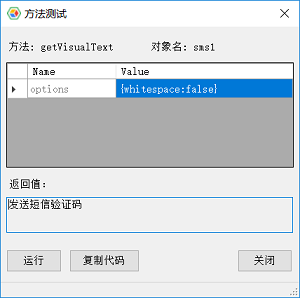

## 图像字符识别(OCR)

本自动化工具支持通过OCR识别控件中的文字。

OCR的支持体现在以下方面：

#### 某些Windows对象上的OCR方法

##### 1. getVisualText方法
下列的Windows对象支持`getVisualText`方法：

1. Image控件
2. Virtual控件

getVisualText方法的函数方法如下：

```javascript
   getVisualText(): Promise<string>;
```

详细说明，请参见[getVisualText方法](virtual_api.md#getVisualTest)

##### 2. clickVisualText方法

clickVisualText方法只存在于Virtual控件中。使用OCR在虚拟控件快照上查找指定的文本，然后点击对应的文字。

```javascript
   clickVisualText(text: string, options?: ClickVisualTextOptions): Promise<void>;
```

详细文档可参见[clickVisualText方法](virtual_api.md#clickVisualText)

#### Ocr库函数

你可以直接使用`leanpro.visual`下的Ocr类，对内存中的图片或图片文件做识别。下面是Ocr库的定义：

```javascript
   class Ocr {
      public static inited: boolean; //readonly
      public static language: OcrLanguage;
      public static init(lang?: OcrLanguage, dataPath?: string): Promise<boolean>;
      public static getVisualText(imageData: Buffer | string, options?: OcrOptions): Promise<string>;
      public static getVisualTextFromFile(filePath: string, options?: OcrOptions): Promise<string>
      public static getTextLocation(imageData: Buffer | string, text: string): Promise<TextBlock>
      public static getTextLocations(imageData: Buffer | string): Promise<TextBlock[][]>;
      public static getTextLocation(imageData: Buffer | string, text: string): Promise<Rect>
    }
```

* **init(lang?: OcrLanguage, dataPath?: string): Promise&lt;boolean&gt;**

  初始化OCR的识别语言库。CukeTest自带识别中文和英文的训练库。OcrLanguage的定义如下:
  
  ```javascript
  enum OcrLanguage {
    English = 'eng',
    ChineseSimplified = 'chi_sim'
  }
  ```
  如果你下载了其它的训练库，可传入相应的库名。dataPath为训练库所在的目录，可不传，使用缺省值。
  
* **getVisualText(imageData: Buffer | string, options?: OcrOptions): Promise&lt;string&gt;**

  传入图片内容的Buffer，或base64编码的字符串，对图片做识别，返回识别文字。
  
* **getVisualTextFromFile(filePath: string, options?: OcrOptions): Promise&lt;string&gt;**

  传入图片文件的路径，对图片做文字识别，返回识别文字。

* **getTextLocations(imageData: Buffer | string): Promise&lt;TextBlock[][]&gt;**

   传入图片内容的Buffer，或base64编码的字符串，对图片做识别，返回识别的文字和位置，文字和位置以词为单位，返回下面TextBlock结构的二维数组，其中的每一个一维数组为一行文字。
   
   ```javascript
    interface TextBlock {
      text: string;
      boundingRect: {
        left: number,
        top: number,
        width: number,
        height: number
      }    
    }
    ```

* **getTextLocation(imageData: Buffer | string, text: string): Promise&lt;Rect&gt;**

  其中:
  * imageData: 图片内容的Buffer，或base64编码的字符串
  * text：需要查找的文字，需是图片中存在的连续文字，且在同一行
  
  返回该文字在图片中的位置的Rectk结构。如果不存的，则返回null;
  
  
>注意：Ocr类的方法都是异步的，返回Promise，所以请在调用中使用await方法等待。

你可以直接调用getVisualText或 getVisualTextFromFile分别针对内存中的或文件中的图片识别其中的文字。它们会使用缺省的语言库，即如果你的界面语言设置是中文，使用中文库来识别，如果界面语言设置为英文，使用英文库来识别。某些情况下，你需要覆盖这个语言设置，那么你在调用识别方法如getVisualText之前，先调用init函数来设置语言，例如下面的代码：


```javascript
   const { Ocr, OcrLanguage } = require('leanpro.visual');
   Ocr.init(OcrLanguage.ChineseSimplified);

   (async () => {
      let text = await Ocr.getVisualTextFromFile("c:\\temp\\sample.png");
      console.log(`text is ${text}`);
   })()
```

上述例子通过显式指定语言库为中文，那么无论当前自动化工具的界面语言是中文还是英文，都会使用中文库来识别文本。

你可以多次调用init方法初始化识别语言库。language属性返回当前的语言库设置。

### 模型管理器中的OCR

通常情况下为使用OCR，你可以在模型管理器中为某个控件中的包含可视文字的部分创建虚拟控件，然后可以在虚拟控件上调用getVisualText方法。你可以在模型管理器中测试getVisualText方法。请注意以下事项：
* 测试的时候，控件区域不要被其它窗口覆盖
* 模型管理器加载的识别库也跟模型管理器的界面语言相关，即英文界面会加载英文语言训练库，中文界面会加载中文库。

如果要在方法测试中去掉识别后文字的空格，可以传输参数{whitespace: false}，如下图：


了解更多虚拟控件内容，请参考[虚拟控件](/model_mgr/virtual_control.md)

### 更多语言支持

如果你需要其它的语言库，可以从[https://github.com/tesseract-ocr/tessdata]( https://github.com/tesseract-ocr/tessdata)下载对应的语言库，并复制到安装目录的tessdata目录下，然后在init方法中初始化成对应的语言即可。例如，你可以下载文件"deu.traineddata"，并在代码中调用"Ocr.init('deu')"做初始化。如果需要识别繁体中文，下载繁体中文的语言训练包文件chi_tra.traineddata。复制到tessdata目录下，使用的时候，初始化语言为繁体中文，Ocr.init('chi_tra');

### 其它控件的OCR支持

虽然并非所有的控件对象都支持OCR文字识别，你可以通过先在控件上调用takeScreenshot获得快照图片，然后调用Ocr.getVisualText方法识别该图片上的文字。如下面的例子：

```javascript
   const { Ocr, OcrLanguage } = require('leanpro.visual');

   (async () => {
      let image = await model.getButton("Clear entry").takeScreenshot();
      let text = await Ocr.getVisualText(image);
      console.log(text);
   })();
```

这个例子从一个按钮上获取图片，并将图片转换成文字。


