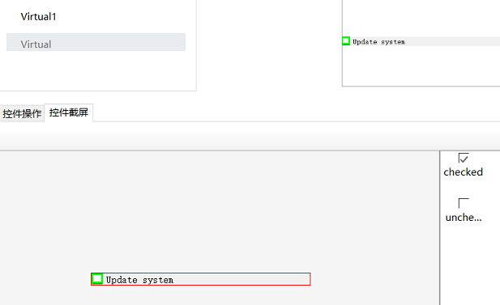

# 虚拟控件API

## 虚拟控件的创建

虚拟控件可通过以下几种方式创建：

1. 在模型中定义

   你可以在对象模型中某个Windows控件对象下创建虚拟控件，相关信息请参见[虚拟控件](../model_mgr/virtual_control.md)

2. 描述式编程

   通过在代码中指定位置信息创建虚拟控件

3. 不带任何参数的getVirtual\(\)方法

   在代码中你可以直接调用某个对象的getVirtual\(\)方法而不带任何参数，这时创建的虚拟控件区域同该对象对应控件的大小一致。这种方式一般用来在某个Windows控件上做图像识别或OCR操作。

   例如你可以调用：

   ```javascript
   let numPad = model.getGeneric("Number pad").getVirtual();
   await numPad.clickVisualText('4');
   ```

   这个例子从计算器应用的数字面板控件获得虚拟控件，并通过OCR识别上面的数字"4"来直接点击这个数字按钮。

## 方法及属性

虚拟控件包括下面的API:

* click
* dblClick
* wheel
* takeSnapshot
* getVirtualText
* clickVirtualText
* takeSnapshot
* findSnapshot
* matchSnapshot

其中，click、dblClick、wheel的调用方法都和其它控件相同。takeSnapshot调用方法也相同，它只截取虚拟控件绘制区域的截图。

### getVisualText方法

getVisualText方法的函数方法如下：

```javascript
getVisualText(): Promise<string>;
```

它会将控件区域的截屏图片上识别所有的文字信息，并转换成文字返回。

例如下面的例子：

```javascript
const { TestModel, Auto } = require("leanpro.win");
let model = TestModel.loadModel(__dirname + "test.tmodel");

(async () => {
   let text = await model.getVirtual("Virtual1").getVisualText();
   console.log('text', text);
})()
```

这个例子里使用了模型中的“Virtual1”虚拟控件，并将其转换为文本返回。

如果某个区域中有多个文字块，需要分别识别，可以定义多个虚拟控件，然后分别对这些控件调用getVisualText\(\)。

### clickVisualText

clickVisualText方法只存在于Virtual控件中。使用OCR在虚拟控件快照上查找指定的文本，然后点击对应的文字。

```javascript
   clickVisualText(text: string, options?: ClickVisualTextOptions): Promise<void>;
```

其中，

* text为单词或词组。需是图片中存在的连续文字，且在同一行
* options为可选参数，包括cache, x, y等：
* cache设置是否缓存识别信息，缺省为false
* x， y设置点击区域， 例如"{x: 1, y: 1}"点击文字区域的左上角。如果x和y是缺省值0，则点击文字框中心区域。

当设置cache为true时，快照识别的文字及位置信息会缓存在控件中，下一次再次调用`clickVisualText`方法并传入cache: true，会重用这些文字位置信息执行操作，无需再次做OCR识别，可加快执行速度。下面是使用cache的样例。

本样例使用Windows自带的计算机为例，识别计算器的数字面板，并添加到模型中对象名为"Number pad"

```javascript
(async function () {
let numPad = model.getGeneric("Number pad").getVirtual();
   await numPad.clickVisualText('4', { cache: true });
   await numPad.clickVisualText('5', { cache: true });
   await numPad.clickVisualText('6', { cache: true });
})();
```

此样例在点击数字"4"的时候稍做停留，因为在做OCR识别，点击"5"和"6"就不需要做OCR识别，直接使用缓存信息，因此较快。

当在文字内容查在给定的控件上找不到的时候，会抛出异常。如果想诊断字符识别问题，可以先调用takeScreenshot方法为控件截屏，然后调用Ocr类上的getTextLocations方法，获得所有识别出的文字和文字位置，然后再诊断，如下样例：

```javascript
(async function () {
    let numPad = model.getGeneric("Number pad").getVirtual();
    let snapshot = await numPad.takeScreenshot();
    let blocks = await Ocr.getTextLocations(snapshot);
    console.log(JSON.stringify(blocks, null, 2))
})();
```

该样例打印出所有控件上文字的识别信息，包括文字和位置。

更多关于OCR说明，请参见[图像字符识别\(OCR\)](ocr.md)

### findSnapshot

给定一个模型中虚拟控件快照的键值，该API截取虚拟控件运行时的快照，返回是否与这个快照匹配。

```javascript
   findSnapshot(): string
```

findSnapshot API，可以对虚拟控件截多个快照，然后在运行时判断属于那个快照:



这里我们在虚拟控件上有两个快照，一个叫做“checked”，一个名为“unchecked”，然后可以在代码中使用：

```javascript
   let snapshotKey = await model.getVirtual("Virtual1").findSnapshot();
   console.log(snapshotKey)
```

当控件被勾选时，上述代码打印出”check“，当未被勾选时打印内容为"uncheck"。当模型中预先设置快照或运行时的快照不匹配任何已有的快照时，返回null;

### matchSnapshot

返回当前运行时的虚拟控件截屏是否与某一个模型中的快照匹配。

```javascript
   matchSnapshot(snapshotKey: string): boolean
```

