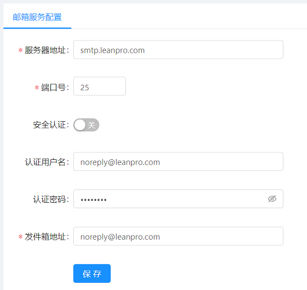

# 资源和配置

用来配置平台的相关资源信息。主要提供如下部分:
1. 部门管理
2. 邮件服务器
3. 代理服务器管理
4. 内容清理
5. 许可证书管理

## 部门管理

管理公司部门，设定部门信息列表

* 新建部门: 创建新的部门。
* 编辑: 编辑修改部门情况。
* 删除: 删除此部门信息。

## 邮件服务器

配置邮件服务器信息:

配置的邮件服务器会用来发送通知邮件，如果某个执行设定了邮件通知，当LeanRunner任务执行成功后，会发送通知邮件给启动任务执行的用户，用户可以点击邮件的中的链接，查看任务执行详情。

## 代理服务器管理

针对RPA运行过程中使用到的服务器代理进行配置。

* 新建代理: 创建新的代理配置。
* 序列: 代理的序号。
* 代理名: 代理设置别名。
* 代理服务器: 代理服务器IP地址。
* 编辑: 配置代理服务器。
* 删除: 删除代理。

LeanRunner提供的用户定制的能力，客户可以用来管理自定制配置信息列表，此部分为定制列表，可提供给脚本执行时获得控制器配置的信息。

## 内容清理

内容清理的策略，以及立即执行清理操作。

LeanRunner控制器在执行任务后会产生执行结果的报告数据，例如日志文件、图片、视频文件等。内容增多后可能对控制器磁盘造成压力。可以在这里配置控制器定期删除不需要的内容。

下面是配置清理策略

内容清理只会删除过期的任务执行结果，不会删除任务本身，或它依赖的流程包文件。下面是它们的配置选项：

1. 执行定时清理：当打开该选项时，会在每天的晚上，系统空闲时执行清理工作
2. 保留执行结果的天数：设置保留最近几天的执行数据，更早的执行结果将被删除。为数据安全起见，系统不允许小于10天的设置。
3. 保留执行结果的最大个数：最多保持指定数量的执行结果，超过这个数量的执行结果将被删除。定时清理将在每天执行，在清理执行前执行结果数量可能超过这个最大数。
4. 立即清理：如果想立即执行清理工作，可点击此按钮，清理任务会立即在后台启动。

## 许可证书管理

请参考[许可证书管理](./license.md)了解更多许可相关内容

