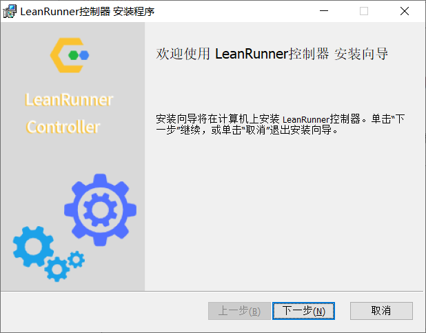
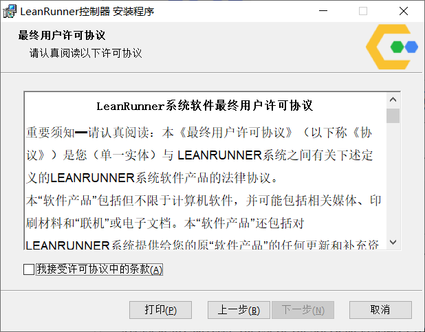
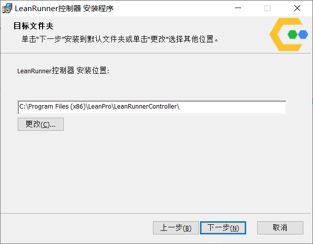
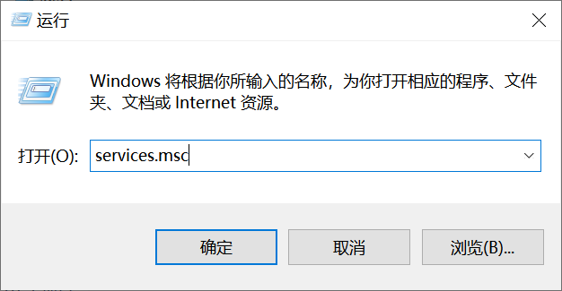
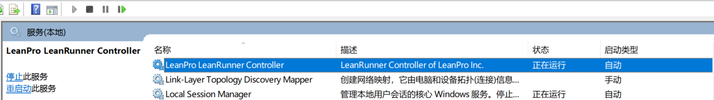

# LeanRunner控制器的安装

- [LeanRunner控制器的安装](#leanrunner%e6%8e%a7%e5%88%b6%e5%99%a8%e7%9a%84%e5%ae%89%e8%a3%85)
  - [LeanRunner控制器简介](#leanrunner%e6%8e%a7%e5%88%b6%e5%99%a8%e7%ae%80%e4%bb%8b)
  - [一、依赖环境安装与配置](#%e4%b8%80%e4%be%9d%e8%b5%96%e7%8e%af%e5%a2%83%e5%ae%89%e8%a3%85%e4%b8%8e%e9%85%8d%e7%bd%ae)
    - [安装依赖项](#%e5%ae%89%e8%a3%85%e4%be%9d%e8%b5%96%e9%a1%b9)
  - [二、应用部署和配置](#%e4%ba%8c%e5%ba%94%e7%94%a8%e9%83%a8%e7%bd%b2%e5%92%8c%e9%85%8d%e7%bd%ae)
    - [安装msi包](#%e5%ae%89%e8%a3%85msi%e5%8c%85)
  - [三、配置数据库](#%e4%b8%89%e9%85%8d%e7%bd%ae%e6%95%b0%e6%8d%ae%e5%ba%93)
    - [配置数据库连接](#%e9%85%8d%e7%bd%ae%e6%95%b0%e6%8d%ae%e5%ba%93%e8%bf%9e%e6%8e%a5)
    - [创建数据库](#%e5%88%9b%e5%bb%ba%e6%95%b0%e6%8d%ae%e5%ba%93)
  - [四、开始使用](#%e5%9b%9b%e5%bc%80%e5%a7%8b%e4%bd%bf%e7%94%a8)
  - [附录1：其它相关配置项](#%e9%99%84%e5%bd%951%e5%85%b6%e5%ae%83%e7%9b%b8%e5%85%b3%e9%85%8d%e7%bd%ae%e9%a1%b9)
  

## LeanRunner控制器简介
聆播科技的LeanRunner控制器 (LeanRunner Controller) 是RPA产品LeanRunner的服务器平台，用于管理所有的RPA机器人。

LeanRunner控制器可部署在Windows或Linux操作系统下。本文描述了在Windows环境下的部署。

## 一、依赖环境安装与配置
### 安装依赖项
LeanRunner控制器后台使用MySQL，因此从MySQL网站上下载较新版本，然后安装。
MySQL 版本要求8.0以上。  

## 二、应用部署和配置
### 安装msi包
首先安装许可服务器的安装包LeanRunner_Controller.msi文件，启动安装后一路确定即可。如下：  

  

  



## 三、配置数据库  
安装成功后需准备数据库。下面是数据库的配置:    

### 配置数据库连接
文本编辑器中打开下面的文件：`C:\Program Files (x86)\LeanPro\LeanRunnerController\server_config.json`
因为文件在安装目录下，您需要以管理员权限运行文本编辑器才能正常保存。

编辑文件中的数据库(host)、用户名(user)、密码(password)和连接方式(insecureAuth)设置，使其符合刚安装好的MySQL数据库实例。保存文件配置。下面是设置前的缺省值：

```json
"db": {
    "connectionLimit": 10,
    "host": "localhost",
    "user": "sa",
    "password": "password",
    "database": "lrcontroller",
    "insecureAuth": true
}
```

### 创建数据库

1. 打开命令行，运行以下命令：
    ```cmd
    lr_controller deploy_db.js
    ```  
   该命令会创建数据表及其它数据库对象。

2. 运行成功后，在命令行或services管理界面中重启LeanRunner控制器的Windows服务。

命令行重启：
在有管理员权限的命令行中，运行：  

   ```
   net stop "LeanPro LeanRunner Controller"
   ```  

然后  

   ```
   net start "LeanPro LeanRunner Controller "
   ```  

在服务管理器界面中重启
 
  
 


## 四、开始使用

打开浏览器访问到LeanRunner控制器网址http://<leanrunner_controller>，如果是从控制器本机访问，地址是http://localhost，访问后，提示用户名和密码，填入缺省的管理员admin用户名123456。登录后请立即修改个人密码。

登录后。进行如下操作：
1. 配置用户
2. 配置邮件服务器（用于执行后的通知）
3. 上传流程库
4. 创建常用的模板
5. 配置并启动LeanRunner机器人，并在控制器中启用此机器人。详情请查看帮助：http://<leanrunner_controller>/zh-cn/server/robot.html
6. 启动任务并查看

## 附录1：其它相关配置项

下面是server_config.json配置文件的样例及说明：

```json
{
    "db": {
        "connectionLimit": 10,
        "host": "127.0.0.1",  // 数据库地址
        "user": "xxx",        // 数据库用户名
        "password": "xxx",    // 数据库密码
        "database": "lrcontroller", // 数据库名
        "insecureAuth": true
    },
    "captcha": false,      // 登录时是否显示验证码
    "logLevel": "warn",    // 日志级别：缺省为warn，可设成error或info
    "webPort": 80,         // 控制器使用的端口，默认为80，如果被占用可设置为其它端口
    "tokenExpiration": 0,  // 登录后多长时间(单位秒)会话过期。缺省86400（一天）
    "webHost": "",         // 发送通知邮件时邮件里的服务器连接地址
    "workspace": "",       // 流程文件存放位置，缺省不设置会放到“C:\ProgramData\LeanPro\LeanRunnerServer”中
}
```

