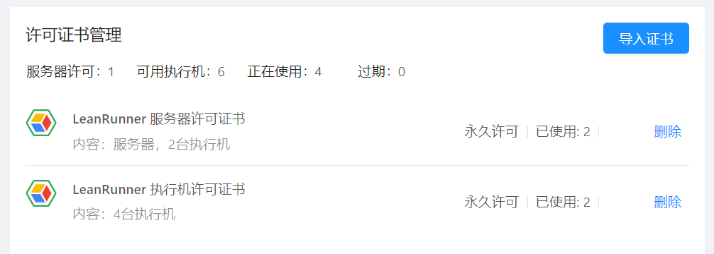

# 软件许可及用量

LeanRunner作为RPA自动化软件，具有免费起步，许可灵活的特点。

LeanRunner分为三部分：设计器、机器人、控制器。下面介绍不同模块部分的许可及用量。

* **设计器**：LeanRunner设计器完全免费。意味着无论您在设计器里开发脚本，还是执行流程脚本，都无需任何费用，且没有用量上的限制。
* **机器人**：机器人在未安装任何许可证书的情况下，有一定的免费额度，超过用量会提示需要许可证书。[机器人的许可及用量](#robot_license)提供了更详细的说明。
* **控制器**：控制器上可安装服务器许可证书及机器人许可证书。在未安装任何许可证书时，可控制一台机器人执行自动化任务。详情请查看[控制器许可证书管理](#server_license)。

LeanRunner许可证书包括两种类型：
1. 控制器许可
2. 机器人许可

## 设计器完全免费

作为对小的公司或组织友好的一款RPA工具，LeanRunner提供了完全免费的设计器。意味着无论您在设计器里开发脚本，还是执行流程脚本，都无需任何费用，且没有用量上的限制。

如果您开发脚本并在小团队内使用，您可以采用完全免费的方案：

在免费的设计器中开发脚本，然后将设计器和脚本同时部署，并在需要时打开脚本执行。这样您就可以无需任何费用实现您的RPA自动化流程。

免费的方案可以得到我们在社区和论坛中的技术支持。

## 机器人的许可及用量

机器人执行模式是指您通过配置机器人执行流程，或通过命令行的方式执行脚本的方式。您可以为机器人安装机器人许可。您是通过机器人方式执行脚本，只会在某些条件下验证机器人许可。在某些场景下，您无需机器人许可也可以执行您的流程。

下面是LeanRunner不同版本针对每次流程执行的用量。

每个流程的用量  | 免费 | 安装许可后
---|---|---
内置自动化库(如Windows自动化、OCR、图像库等)  |  2000 | 没有限制

内置自动化库是指LeanRunner提供的自动化API，例如操作Windows应用、Java应用、图像识别、OCR等自动化API。没有安装任何许可时，每执行一个流程可连续调用2000次这些API。如果超过则会提示需要许可。如果安装了机器人许可证书，可以执行任何的流程。

使用方式举例：

* **使用场景1：Web场景，无需任何许可证书。**
  
  A公司使用开源的Web自动化库（例如selenium或puppeteer)实现了自动化Web流程，并使用了LeanRunner机器人驱动流程的场景。每次流程执行用到内置的OCR API做图片识别，但每次流程执行只调用100多次。

  这种情况下，因为使用到主要是开源自动化库，并且调用内置API次数没有超过2000次，因此无需任何许可证书也可以执行流程。

* **使用场景2：Windows应用RPA，需要机器人证书。**
  
  B公司使用在Windows平台上Qt开发的桌面应用，通过LeanRunner实现了RPA自动化流程。因为在自动化的流程中，大量的使用了内置的Windows自动化、图片识别、OCR识别等API，每次流程的执行相关的调用超过了2000次。

  因为这种情况下API的调用次数超过了免费用量，B公司通过安装机器人许可，将允许用量升级到无限。因此可自由的执行任何复杂度的RPA自动化流程。

**机器人许可安装方式**

机器人许可证书按照安装方式的不同，分为**单机版证书**和**浮动许可证书**：

* **单机版机器人证书**直接安装在某台电脑的机器人上。
* **浮动机器人证书**安装在某台控制器上，当机器人连接到控制器上时，自动获得机器人证书。当已连接的一台机器人停止运行后，相应的机器人证书会释放，控制器可以把这个证书分配给其它的机器人使用。

## 控制器许可证书管理

通过在LeanRunner控制器上安装许可证书，可以解锁LeanRunner的相应功能。一台控制器上可安装一个控制器许可和多个浮动机器人许可。

* 控制器许可用来解锁LeanRunner控制器的完全版功能。

* 机器人许可用来：
  1. 解锁这台控制器可管理的机器人数量。例如，当LeanRunner控制器安装了3个机器人许可，则可同时使用3个机器人并发执行RPA任务，提高自动化任务的吞吐能力。
  2. 每个连接到这个控制器的机器人，都会获得无限用量的流程执行能力。详细内容可查看上文[机器人的许可及用量](#robot_license)。

这是控制器上的许可安装界面：

### 许可证使用模式：

在使用控制器执行时，有下面几种使用模式。

1. **单机器人模式**

   如果要使用一个控制器和一个执行机执行任务，只需安装一个机器人许可。这种模式下，控制器可以操作机器人执行所有类型的流程。控制器和机器人既可以装在同一台机器上，也可以选择装在不同的机器上。单机器人模式无需购买控制器许可，因此价格低廉，能够满足小规模RPA自动化需求，为刚启动RPA自动化业务的企业用户提供了高性价比的选择。
   
   在只安装一个机器人许可的情况下，如果配置了多个机器人连接到控制器，只有一台机器人能够启用并执行任务，其它连接到控制器的机器人将被禁用。
   

2. **多机器人模式**

   一个控制器可并发操作多个机器人完成任务，需要安装一个控制器许可和跟机器人数量的机器人许可。多机器人模式下，一台控制器可以连接多达32台机器人执行自动化任务。并能使用所有控制器平台的所有功能。

   多机器人模式能够满足几乎所有企业的RPA自动化的吞吐量需求。

3. **试用模式**

   在没有安装任何许可时，是试用模式。在产品首次安装后的3个月内属于试用期。试用期内，控制器可以操作最多2台机器人执行任务，超过试用期后，在未安装证书情况下，控制器可以连接一台机器人。如果需要支持更多的机器人，请通过安装相应许可，切换到多机器人模式。

## 许可证使用期限

按照使用期限划分，许可证分为：

* 固定期限使用许可
* 永久许可

固定期限使用许可以年为单位。

### 其它使用方式及许可需求

在不通过控制器使用LeanRunner的场景中，大部分情况下无需许可证书可以自由使用，在少数场景下会检查许可证书，下面是详细描述。

1. **设计器**

使用设计器可以开发RPA自动化流程，在界面中开发、运行流程无需安装任何许可。

2. **命令行**

LeanRunner的设计器应用也支持通过命令行执行，通过命令行独立执行一个RPA自动化脚本，也能够实现RPA自动化。大多数情况下命令行执行RPA无需许可，可细分为下面几种情形：

* 命令行方式在执行纯Web的RPA自动化时无需任何许可。
* 通过命令行调用其它内置自动化API在一定量范围内，无需任何许可。
* 通过命令行大量调用内置API时，会检查机器人许可。例如一个RPA脚本长时间自动化原生Windows应用时，会触发机器人许可的检查。