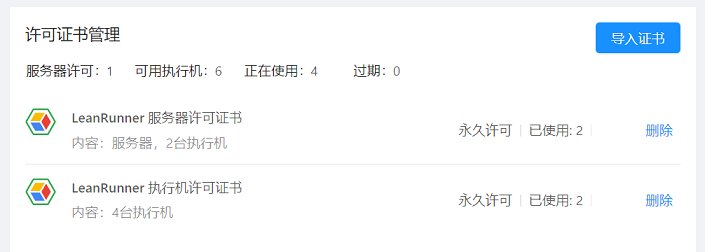

# 许可证书管理

通过在LeanRunner控制器上安装许可证书，可以解锁LeanRunner的相应功能。

LeanRunner许可证书包括两种类型：
1. 控制器许可
2. 机器人许可

控制器许可用来解锁LeanRunner控制器的完全版功能。

机器人许可用来解锁LeanRunner可管理的机器人数量。例如，当LeanRunner控制器安装了3个机器人许可，则可同时使用3个机器人并发执行RPA任务，提高自动化任务的吞吐能力。

### 许可证使用模式：

在使用控制器执行时，有下面几种使用模式。

1. **单机器人模式**

   如果要使用一个控制器和一个执行机执行任务，只需安装一个机器人许可。这种模式下，控制器可以操作机器人执行所有类型的流程。控制器和机器人既可以装在同一台机器上，也可以选择装在不同的机器上。单机器人模式无需购买控制器许可，因此价格低廉，能够满足小规模RPA自动化需求，为刚启动RPA自动化业务的企业用户提供了高性价比的选择。
   
   在只安装一个机器人许可的情况下，如果配置了多个机器人连接到控制器，只有一台机器人能够启用并执行任务，其它连接到控制器的机器人将被禁用。
   

2. **多机器人模式**

   一个控制器可并发操作多个机器人完成任务，需要安装一个控制器许可和跟机器人数量的机器人许可。多机器人模式下，一台控制器可以连接多达32台机器人执行自动化任务。并能使用所有控制器平台的所有功能。

   多机器人模式能够满足几乎所有企业的RPA自动化的吞吐量需求。

3. **试用模式**

   在没有安装任何许可时，是试用模式。在产品首次安装后的3个月内属于试用期。试用期内，控制器可以操作最多2台机器人执行任务，如果需要支持更多的机器人，请通过安装相应许可，切换到多机器人模式。

## 许可证使用期限

按照使用期限划分，许可证分为：

* 永久许可
* 固定期限使用许可

固定期限使用许可以年为单位。

### 其它使用方式及许可需求

在不通过控制器使用LeanRunner的场景中，大部分情况下无需许可证书可以自由使用，在少数场景下会检查许可证书，下面是详细描述。

1. 设计器

使用设计器可以开发RPA自动化流程，在界面中开发、运行流程无需安装任何许可。

2. 命令行

LeanRunner的设计器应用也支持通过命令行执行，通过命令行独立执行一个RPA自动化脚本，也能够实现RPA自动化。大多数情况下命令行执行RPA无需许可，可细分为下面几种情形：

* 命令行方式在执行纯Web的RPA自动化时无需任何许可。
* 通过命令行调用其它内置自动化API在一定量范围内，无需任何许可。
* 通过命令行大量调用内置API时，会检查机器人许可。例如一个RPA脚本长时间自动化原生Windows应用时，会触发机器人许可的检查。