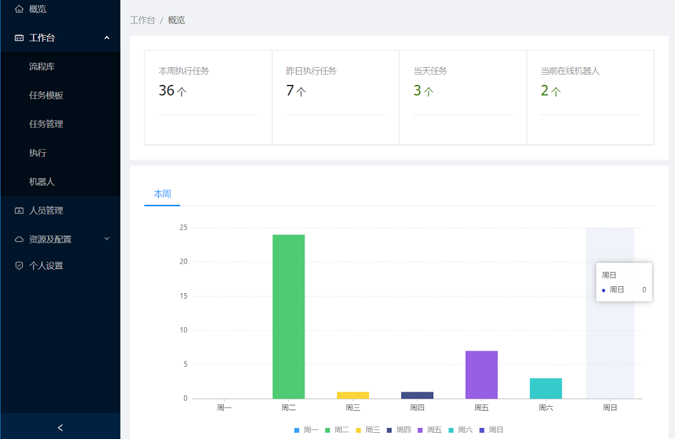

# LeanRunner服务器

LeanRunner是RPA自动化软件，它包含服务器、设计器、执行机三部分组件。服务器作为RPA的控制器，可以上传RPA脚本，管理执行机，设定执行任务、监控执行等多种功能。

参考下面功能描述：

* [工作台](workspace.md)
  提供RPA的任务和执行的管理
* [用户及权限](user_manage.md)
  用户管理及权限设定
* [资源配置](config.md)
  LeanRunner服务器的相关配置

## 概览

点击“概览”打开LeanRunner的仪表盘，可显示RPA执行的任务情况，例如本周、昨天、今天等不同时段执行的任务数量，当前在线执行机等情况。

