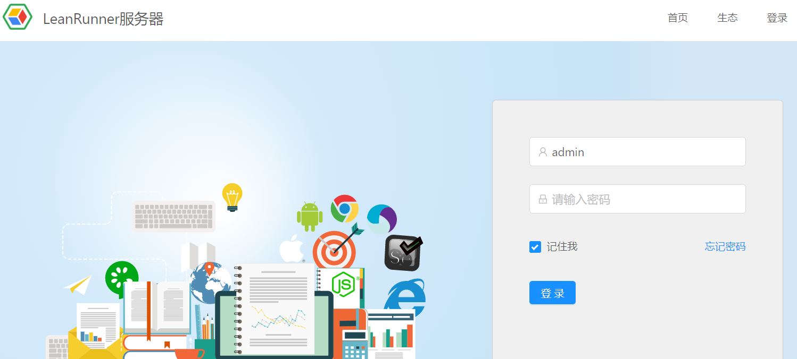
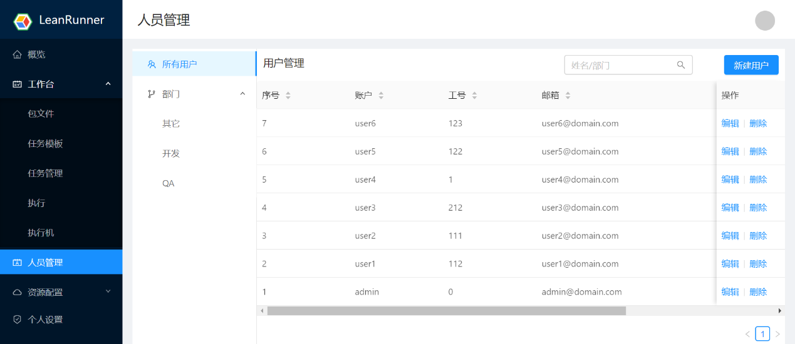
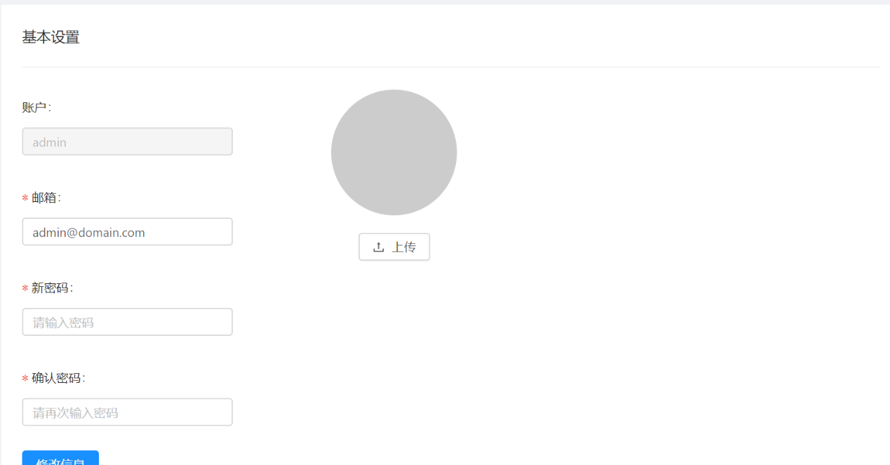

# 用户及权限

## 用户登录

浏览器打开LeanRunner服务器，点击左上角的登录菜单，进入登录界面。输入用户名、密码，点击登录，进入LeanRunner的管理界面。

登录LeanRunner服务器的用户可以有不同的权限。用户分为管理员和普通用户。管理界面会根据用户权限不同，显示对应的菜单项。

管理LeanRunner服务器平台的用户，创建、删除用户，修改用户的信息。

界面功能包括：
* 创建用户: 创建一个新的用户。
* 用户搜索: 搜索用户。
* 编辑: 修改用户信息。
* 删除: 删除此用户。
可以编辑的字段包括：账户、工号、邮箱、电话、部门等。

## 个人设置

当前用户查看或设置基本信息。

* 账户: 用户的账户名。
* 邮箱: 用户邮箱。
* 新密码: 配置新密码。
* 确认密码: 确认新密码。
* 修改信息: 确定修改新信息。
* 头像上传: 上传新的头像信息。