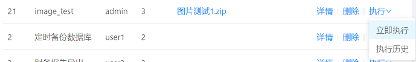
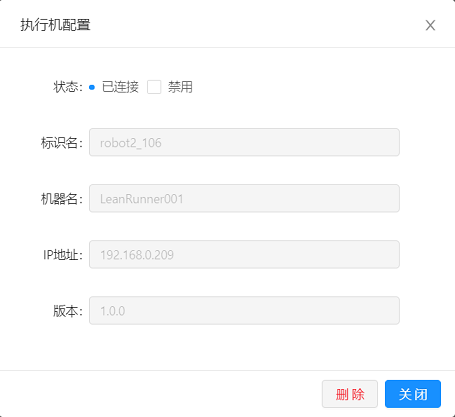

# 工作台

工作台是LeanRunner控制器管理任务执行的主要功能区。包括如下:

* 流程库管理
* 任务模板管理
* 任务管理
* 执行管理
* 机器人管理

## 流程库管理

流程库管理的是任务执行的时候需要的流程包文件（下面简称包文件），它可以是：

* zip格式文件，包含RPA脚本
* 一个*.js后缀的单独的RPA Javascript文件。
* RPA自动化脚本所依赖的库
* zip文件包含的其它任何数据文件

RPA 代码文件主要通过包管理平台进行维护。可以通过该界面上传新包，更新已有的包，配置包的名称，描述等信息或删除包。

下面是流程库的管理界面：

* 新建流程: 当编写了RPA脚本，可以上传到控制器进行管理。
* 配置: 当RPA代码有更改可以在配置选项中进行更新。
* 删除: 删除当前RPA文件。

包文件在执行时会下发到机器人，格式为ZIP的包文件会解压到执行目录，然后执行自动化操作。

### 流程包的编辑

点击“新建流程”，或是在一个已有的流程上点击配置，可以打开流程包文件的编辑界面，如下图：

* 上传包文件会替换旧的包文件。
* 名称: 为这个包的命名，可以是任何便于记忆的名称。
* 描述: 包的功能描述信息。
注意：任务可以使用一个或多个包，修改一个包的名称不影响现有任务对这个包的引用。

### 任务模板管理

任务模板可以用来快速创建一个新的任务。用户可创建常用任务模板，用来快速创建新的任务。下面是任务模板的管理界面：

任务模板主要功能：
* 新建任务模板: 创建新的任务模板。
* 配置: 对任务模板进行配置。
* 删除: 删除此任务模板。
* 创建任务: 根据此模板创建任务管理。

新建/编辑任务模板

任务标签页:

* 名称: 任务模板名称。
* 标签: 为不同的任务模板添加不同的标签。
* 流程包: 所使用的RPA流程包。
* 描述: 模板的描述信息。
* 运行命令: 设置RPA 执行命令。

数据标签页
* 数据模板: RPA运行的数据模板文件。

## 任务管理

任务管理界面用来在创建和管理RPA的任务。管理员权限的用户在这里可以查看所有的任务，普通用户权限可以查看并编辑自己创建的任务。

下面是任务管理界面：

* 新建任务: 创建新的任务。
* 删除: 删除此此任务。
* 执行: 分为立即执行与执行历史； 立即执行则马上执行此任务，执行历史则是展示此任务执行的历史情况。

### 新建任务

新建任务功能与新建任务模板功能类似。可以参考新建任务模板相关界面说明。

任务标签页：
* 名称: 任务名称。
* 优先级: 对此任务设置优先级。数字越小表明优先级越高。

数据页：
* 数据: 此任务对应的数据文件。
* 定时: 是否是定时任务，如果是定时任务，则在此处显示定时信息。

## 执行历史

选择一个任务的执行历史，可以查看这个任务相关的所有相关的执行历史信息：

* 选择左侧的执行时间，详细页面中可显示执行的详细内容。
* 立即执行: 执行当前任务。

在某个任务的下拉菜单中选择“立即执行”：

会计划一个任务的执行，同时会转到任务执行详情页面。如果有空闲的机器人，会立即启动执行任务。

## 执行管理

所有任务的执行管理可以在“执行”界面中管理。
任务执行历史。点击详情-可以看到任务执行情况

* 近3天/近7天/所有: 选择浏览部分结果
* ID:  任务执行ID
* 标题: 执行任务的标题
* 用户名: 执行此任务的用户信息
* 机器人: 执行任务的机器
* 启动时间: 任务启动的时间
* 结束时间: 任务结束的时间
* 状态: 当前任务执行状态，分为完成，失败，未启动，强制停止
* 详情: 任务执行的详细信息
* 操作: 对当前任务根据状态有相应的可执行操作，如冻结、强制停止和删除：
    * 冻结：任务计划执行，但尚未启动，可以选择冻结这个执行。有时候，可以通过冻结其它待执行任务，让某个任务优先执行
    * 恢复：恢复一个已经冻结的任务到正常状态，将由可用的机器人执行
    * 强制停止: 任务在执行过程中被强制停止
    * 删除：删除此任务

## 执行报告

在上面的执行管理界面点击某一条执行记录，查看执行报告。执行报告分为两部分：汇总信息和执行详情。

1. **汇总信息**

    汇总信息如下图：
    

    它包含的字段内容：
    * 用时: 执行此任务总耗时。
    * 成功: 成功的步骤数量。
    * 失败: 失败的步骤数量。
    * 跳过: 跳过个数。
    * 开始时间: 运行开始时间。
    * 结束时间: 运行结束时间。
    * 创建人: 创建此任务的用户。
    * 命令行: 执行此任务的命令行脚本。
    * 数据文件: 驱动此任务的数据文件。
    * 其它: 执行过程中的错误截屏。

    “成功”和“失败”按钮除了显示本次执行的成功、失败步骤数量以外，它们也是过滤器。点击后会过滤掉相应的步骤。例如在初始显示的时候，所有步骤都会显示，当点击“成功”后，成功按钮会隐藏，界面只会显示所有出错的步骤。

2. **执行详情**

    在汇总信息的下面，会显示执行的场景和步骤信息，如下：

    

    脚本中定义的场景和步骤会显示在执行监控。

    执行状态分为以下几类：
    * 未启动：刚创建的任务执行，还未分发给任何机器人执行
    * 完成：执行结束
    * 失败：执行过程中因为异常导致执行无法启动，例如机器人所在的执行机上没有安装某些依赖组件，或流程包文件在控制器上被不小心手动删除等。
    * 执行中：执行正在进行，执行的步骤信息会实时发送到任务详情页面，显示当前的执行状态。 
    * 强制停止：执行中的任务，如果用户发现执行有异常，可以通过点击下图中的“立即停止”，选择手动停止任务的执行。

    

    如果任务执行失败，需要重新执行，请打开关联的任务，点击“立即执行”。

<a id="robot_manage">
## 机器人管理

管理控制器上连接的机器人：

它的界面上有如下的元素：
* ID: 数据库中的机器人ID。
* 标识名: 机器人别名。
* 机器名: 机器名称。
* IP地址: 机器人所在的执行机的IP。
* 平台: 机器人所在操作系统的平台，例如 win32或Linux。
* 版本: 机器人所在操作系统的版本号。
* 状态: 机器人的运行状态，例如离线、禁用、已连接等
* 配置: 机器人的配置信息。
* 详情: 机器人的运行日志。
* 删除: 删除此机器人。

在某一机器人上点击“配置”，可以打开机器人配置界面，查看更多详情。例如，可以禁用某机器人。

当某个新的机器人连接到控制器时，这个机器人是被禁用的，即不会被分配执行任务。只有在此界面中启用机器人，它才能获取任务并执行。

## 机器人配置

* 状态: 当前机器人的状态。
* 禁用选项：用于禁用机器人的复选框。设置某机器人禁用后，它不会执行新的任务，但是在禁用前已经开始的任务将会继续在该机器人上执行直到完成。
* 删除: 删除此机器人。该功能通常是用来删除已经不使用的机器人。