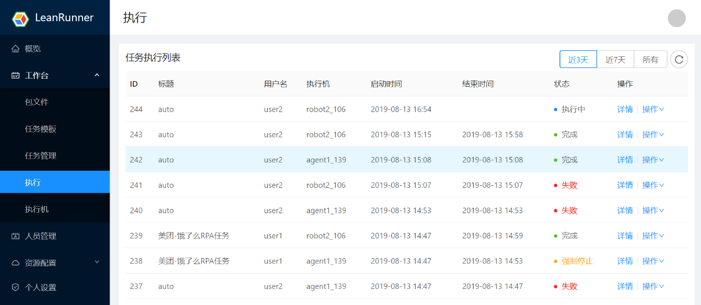
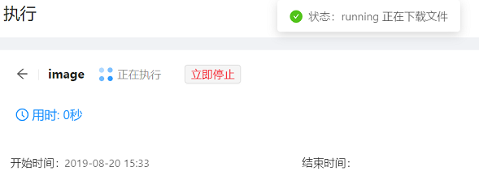

# 工作台

工作台是LeanRunner服务器管理任务执行的主要功能区。包括如下:

* 包文件管理
* 任务模板管理
* 任务管理
* 执行管理
* 执行机管理

# 包文件管理

包文件管理的是任务执行的时候需要的文件，包文件可以是：

* zip文件包含的自动化脚本
* 一个*.js后缀的单独的Javascript脚本。
* 自动化脚本所依赖的库
* zip文件包含的其它任何数据文件

RPA 代码文件主要通过包管理平台进行维护。可以通过该界面上传新包，更新已有的包，配置包的名称，描述等信息或删除包。

下面是包文件的列表管理界面：

* 上传新包: 当编写了新得项目的RPA代码，可以通过上传新包进行管理。
* 配置: 当RPA代码有更改可以在配置选项中进行更新。
* 删除: 删除当前RPA文件。

包文件在执行时会下载到执行机，格式为ZIP的包文件会解压到执行目录，然后执行自动化操作。

## 包的配置

点击“上传新包”，或是在一个已有的包上点击配置，可以打开包文件的编辑界面，如下图：

* 上传包文件会替换旧的包文件。
* 名称: 为这个包的命名，可以是任何便于记忆的名称。
* 描述: 包的功能描述信息。
注意：任务可以使用一个或多个包，修改一个包的名称不影响现有任务对这个包的引用。

## 任务模板管理
任务模板可以用来快速创建一个新的任务。用户可创建常用任务模板，用来快速创建新的任务。下面是任务模板的管理界面：

任务模板主要功能：
* 新建任务模板: 创建新的任务模板。
* 配置: 对任务模板进行配置。
* 删除: 删除此任务模板。
* 创建任务: 根据此模板创建任务管理。

新建/编辑任务模板

任务标签页:

* 名称: 任务模板名称。
* 标签: 为不同的任务模板添加不同的标签。
* 部署包: 所使用的RPA文件包。
* 描述: 模板的描述信息。
* 运行命令: 设置RPA 执行命令。

数据标签页
* 数据模板: RPA运行的数据模板文件。

# 任务管理

任务管理界面用来在创建和管理RPA的任务。管理员权限的用户在这里可以查看所有的任务，普通用户权限可以查看并编辑自己创建的任务。

下面是任务管理界面：

* 新建任务: 创建新的任务。
* 详情: 此任务的具体详情。
* 删除: 删除此此任务。
* 执行: 分为立即执行与执行历史； 立即执行则马上执行此任务，执行历史则是展示此任务执行的历史情况。

## 新建任务

新建任务功能与新建任务模板功能类似。可以参考新建任务模板相关参数。

* 名称: 任务名称。
* 创建者: 创建此任务的人员名称。
* 优先级: 对此任务设置优先级排名。
* 文件: 此任务对应的数据文件。
* 定时: 是否是定时任务，如果是定时任务，则在此处显示定时信息。

# 执行历史

选择一个任务的执行历史，可以查看这个任务相关的所有相关的执行历史信息：

* 选择左侧的执行时间，详细页面中可显示执行的详细内容。
* 立即执行: 执行当前任务。

  在某个任务的下拉菜单中选择“立即执行”：

会启动任务的执行，同时会转到任务执行详情页面：

任务执行的具体信息汇总，可以在左边导航栏点击具体执行时间切换到所选日期的执行具体情况；具体信息可以参考执行详情内容。

# 执行管理

所有任务的执行管理可以在“执行”界面中管理。
任务执行历史。点击详情-可以看到任务执行情况

* 近3天/近7天/所有: 选择浏览部分结果
* ID:  任务ID
* 标题: 执行任务的标题
* 用户名: 执行此任务的用户信息
* 执行机: 任务执行的机器
* 启动时间: 任务启动的时间
* 结束时间: 任务结束的时间
* 状态: 当前任务执行状态，分为完成，失败，未启动，强制停止。
* 详情: 任务执行的详细信息。
* 操作: 分为强制停止和删除。
* 强制停止: 任务在执行过程中强制停止当前执行任务。
* 删除: 删除此任务。

# 执行详情

在上面的执行管理界面点击某一条执行记录，查看执行的详情。执行详情如下图：

* 用时: 执行此任务总耗时。
* 成功: 成功的步骤数量。
* 失败: 失败的步骤数量。
* 跳过: 跳过个数。
* 开始时间: 运行开始时间。
* 结束时间: 运行结束时间。
* 创建人: 创建此任务的用户。
* 命令行: 执行此任务的命令行脚本。
* 数据文件: 驱动此任务的数据文件。
* 其它: 执行过程中的错误截屏。

“成功”和“失败”按钮除了显示本次执行的成功、失败步骤数量以外，它们也是过滤器。点击后会过滤掉相应的步骤。例如在初始显示的时候，所有步骤都会显示，当点击“成功”后，成功按钮会隐藏，界面只会显示所有出错的步骤。

步骤显示：
在执行详情的下面，会显示执行的场景和步骤信息，如下：

脚本中定义的场景和步骤会显示在执行监控。

执行状态分为以下几类：
* 未启动：刚创建的任务执行，还没有执行机启动该任务执行
* 完成：执行结束
* 失败：执行过程中因为异常导致执行无法启动，例如执行机上LeanRunner设计器没有安装，包文件在服务器上被手动删除等。
* 执行中：执行正在进行，执行的步骤信息会实时发送到任务详情页面，显示当前的执行状态。 

* 强制停止：执行中的任务，如果用户发现执行有异常，可以通过点击下图中的“立即停止”,选择手动停止任务的执行。

如果任务执行失败，需要重新执行，请打开关联的任务，点击“立即执行”。

# 执行机管理

管理服务器上连接的执行机：

ID: 执行机ID。
标识名: 执行机别名。
机器名: 机器名称。
IP地址: 执行机的IP。
平台: 执行机所在系统平台。
版本: 执行机系统版本号。
状态: 执行机的运行状态。
配置: 执行机的配置信息。
详情: 执行机的运行日志。
删除: 删除此执行机。

在某一执行机上点击“配置”，可以打开执行机配置界面，查看更多详情。例如，可以禁用某执行机。

# 执行机配置

* 状态: 当前执行机的状态。
* 禁用选项：设置某执行机禁用后，它不会执行新的任务，但是在禁用前已经开始的任务将会继续在该执行机上执行。
* 删除: 删除此执行机。该功能通常是用来删除已经不使用的执行机。