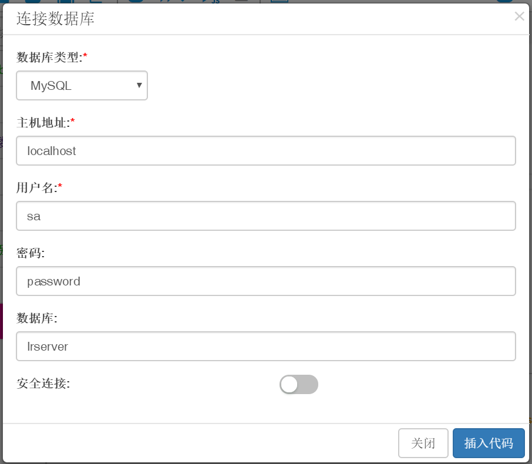
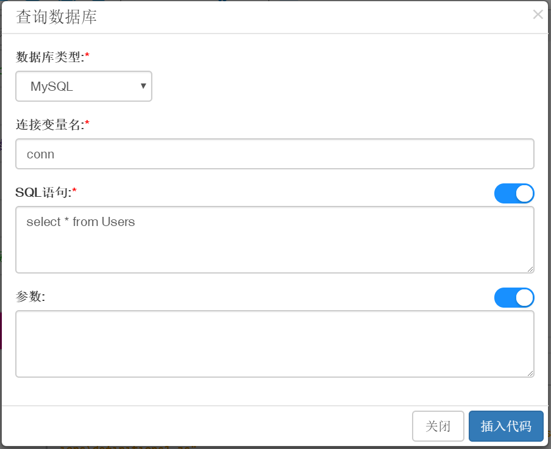

## 数据库访问

工具箱中提供了多种访问数据库的方法，下面以MySQL举例说明它的使用。

### 连接和查询MySQL数据库

提供操作MySQL数据库相关的工具函数，通过直接require引入`leanpro.mysql`库来使用。  

```js
    const mysql = require('leanpro.mysql');
```  

`leanpro.mysql`库封装了`mysql`库，并提供了返回Promise的`query`方法，`query`方法可以用来执行查询、更新、删除等操作。下面是它的函数说明：

```javascript
    query(connection: Connection, query: Query): Promise<any>;
    query(connection: Connection, options: string | QueryOptions): Promise<any>;
    query(connection: Connection, options: string, values: any): Promise<any>;

```

`leanpro.mysql`库是对`mysql`库的简单封装，下面简单举例说明，更多的详细的调用方法可以查看[mysql npm包](https://www.npmjs.com/package/mysql)。

#### 连接数据库

输入数据库的信息，包括主机名称、用户名、密码、数据库名称、是否为安全连接，来创建对目标数据库的连接。

  

生成的代码如下：
```js
    const mysql = require('leanpro.mysql');
    let connectionSetting = {
        "host": "localhost",
        "user": "sa",
        "password": "password",
        "database": "my_database",
        "insecureAuth": true
    }
    let conn = mysql.createConnection(connectionSetting);
```

这样便完成了数据库连接的创建，在下一步中我们来操作数据库并验证连接的有效性。

#### 查询数据库

根据SQL语句来查询指定数据库。



生成的代码如下：
```js
    let res = await mysql.query(conn, "select * from Users");
```

结合上一步创建的数据库连接，并填写在`async`函数体内部，最后将查询结果打印输出到控制台，完整代码如下：

```js
    const mysql = require('leanpro.mysql');
    (async function () {
        let connectionSetting = {
            "host": "localhost",
            "user": "sa",
            "password": "password",
            "database": "my_database",
            "insecureAuth": true
        }
        let conn = mysql.createConnection(connectionSetting);
        let sql = "select * from Users";
        let res = await mysql.query(conn, sql);
        console.log(JSON.stringify(res));
        conn.end();
    })();
```  

运行结果与你的SQL和数据内容相关，以下只是范例：
```json
    [{
        "UserId": 1,
        "UserName": "admin",
        "Email": "admin@domain.com",
    }, {
        "UserId": 2,
        "UserName": "user1",
        "Email": "user1@domain.com"
    }, {
        "UserId": 3,
        "UserName": "user2",
        "Email": "user2@domain.com"
    }]
```  

注意我们在代码中调用了`conn.end()`方法，关闭数据库连接，这样才能正确结束脚本执行。实际使用中可在所有数据库操作结束后调用这条语句关闭连接。
