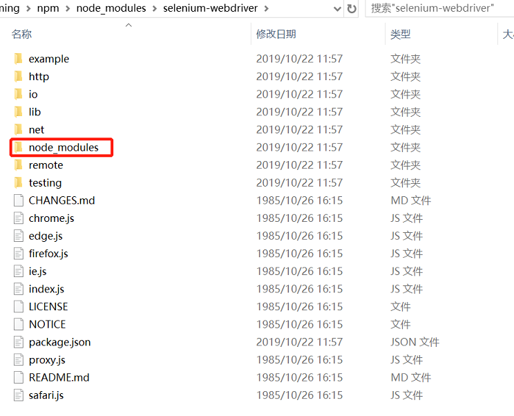

# 离线环境安装npm包

在使用node时，如要用第三方库，可使用npm install命令安装。它会自动从网上的npm库中下载对应的包文件，比较方便。
有些情况下，或在有些公司中，开发环境无法直接连接外网,只能在离线环境下使用开发。就不能直接使用npm包管理工具通过网络下载安装依赖库。

这里介绍的方法是将依赖库制作成为一个tar文件，然后直接使用npm install xxxx.tgz，离线安装这个依赖库文件。

## 制作tar包

首先在有互联网连接的环境的情况自作依赖库的tar包，步骤如下：

1. **安装npm-pack-all工具**

   `npm-pack-all`可以将npm库文件打包为一个tar文件，访问[https://www.npmjs.com/package/npm-pack-all](https://www.npmjs.com/package/npm-pack-all)了解更多。

   执行下面命令安装它：

   ```
    npm install -g npm-pack-all
   ```

2. **下载你要打包的库**

   一个npm库通常又会依赖其它的npm库。为了离线使用，它和它所有的依赖库都需要打包起来。我们现在以"selenium-webdriver"为例介绍在Windows操作系统上的打包过程。

   这是一个自动化web网站常用的库，通常装在自动化脚本所在的本地目录。这里为了打包，需要全局安装。运行下面的命令全局安装这个库：

   ```
   npm install -g selenium-webdriver
   ```

   使用 -g 参数安装会自动把selenium-webdriver依赖的包放在全局目录下，即`%userprofile%\AppData\Roaming\npm`。类似这样:

    

   从上图中可以看到，全局安装的特点是，这个包的所有依赖包都安装在了自己的目录下的node_modules子目录里。

3. **制作tgz文件**

   * 在命令行下，通过 `cd %appdata%\npm\node_modules\selenium-webdriver`调整当前目录到selenium-webdriver目录下。

   * 执行 npm-pack-all 

   * 执行完毕后，会在当前目录下生成 .tgz文件，这里生成的文件为selenium-webdriver-4.0.0-alpha.5.tgz。根据你实际安装的npm包文件版本不同，这个文件有可能不同。


## 离线安装

将上一步生成的 .tgz 文件复制到离线的机器上，在你的项目目录下执行`npm install <your_tgz_file>`命令，安装这个包：

```
npm install selenium-webdriver-4.0.0-alpha.5.tgz
```

即可将库文件安装成功。


