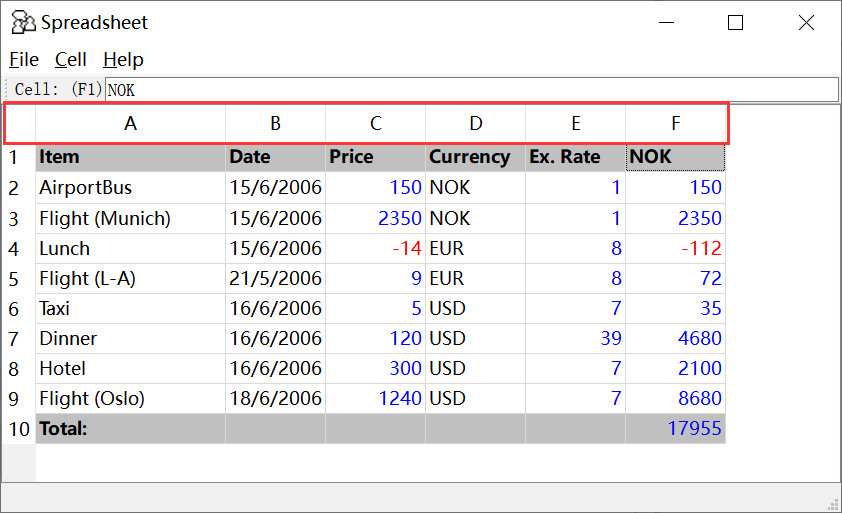

# Qt中Table的自动化

这里会介绍Qt中Table控件的自动化。我们以Qt Demo提供的SpreadSheet为例进行讲解。
  

### Table控件特点

简单控件在自动化过程中，一般通过在模型管理器中先做对象拾取，添加到对象模型中，最后将对象拖拽到代码编辑器中，生成获取对象的`get[ControlType]`的方法，以及操作它的方法。

Table控件有行、单元格等子控件，使用上述传统的方法并不能有效灵活的操作Table控件的行和单元格等子元素，

首先对Qt Table中的各个部分进行控件类型分析，一张完整的表通常由几个控件构成：
```
    - Table 表格控件
        - Custom 行控件
            - Header 表头控件，无法编辑
            - DataItem 单元格控件，双击后可编辑

```

从节点树中也可以看出来一张表格中的控件内容。  
  

### 操作Table中的单元格

为操作Table控件中的某个单元格，首先要在自动化过程中动态定位到它。有两种方式可以实现。

#### 方法1. 利用模型中的行和单元格控件，动态设定index属性

仍旧使用`get[ControlType]`API，具体查看[获取对象API](/node_api/node_container.md)，在获取模型对象时动态提供index属性，例如，已知目标单元格的位置信息，比如n行m列。假设我们需要获取表格中`A6`单元格的控件对象，可以直接利用位置信息来获取，代码如下：

   ```js
    target = {
        row: 6,
        column: 0
    }
    let row = model.getTable("Table").getCustom({ index: target.row });
    let cell = row.getDataItem({ index: target.column });
    console.log(await cell.value());
   ```

结果如下：  

     

该代码获取的是第6行第1个单元格的对象控件。关于控件的索引值需要结合父控件和控件类型进行理解，这里行索引值为6的`Custom`控件（即行控件）正好指向第6行的原因，是由于表格中的横坐标尺是作为表内第一个`Custom`控件，索引值为0；那又为什么第1个单元格的索引值为0呢？这是因为单元格的控件类型为`DataItem`，而其父控件为`Custom`，并且其头部，也就是纵坐标尺的控件类型是`Header`，因为我们获取的是第一个`DataItem`控件，因此直接使用0来索引即可。总而言之，**对指定类型控件的索引是在父控件下、同种类型控件列表中索引的**。

     

#### 方法2: 通过getControls调用动态拿到控件数组，批量操作

上述方法能够拿到单个的单元格控件，然后操作这个单元格。有时我们需要批量操作多个单元格。这时候可以利用getControls方法，它可以返回一组符合过滤条件的子控件。

如需要遍历表格获取符合条件的单元格，那么可以先取到所有控件对象，再筛选出满足条件的对象。假设我们需要输出表格中所有价格大于0的项目，就可以取出所有控件，经过筛选后输出，代码如下：

   ```js
    let table = await model.getTable("Table");
    let rows = await table.getControls({type:"Custom"});
    await rows.map(async (row) => {
        let cells = await row.getControls({ type: "DataItem" });
        let price = await cells[2].value();
        if(parseInt(price) > 0) {
            let cell = await cells[0].value();
            console.log(cell, ":", price);
        }
   ```

结果如下：  

     

在运行中会报一个`warning`，这是因为第一个行控件中不存在`Custom`控件对象从而导致警告信息。  

上述代码是先获取到全部的行控件，再对每一个行控件，拿到它所有的单元格控件，然后再通过索引访问中间需要的控件。比如已知价格`Price`列在第三列，因此索引值为2，而项目名`Item`列在第一列，因此索引值为0。通过这些索引值来取出相应的值。

### 总结

以上就是关于通过父控件来取得目标控件的方法。在目标控件没有明确标识符时，先获取它的父控件，再一层一层的往下解构直到获取到目标控件。除了应用在Qt的Table控件外，也可以应用在其它类似的组合控件中，如List、Tree等。