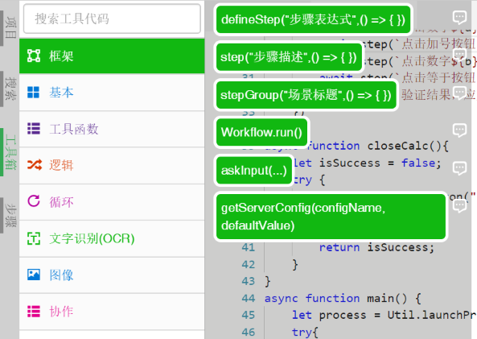
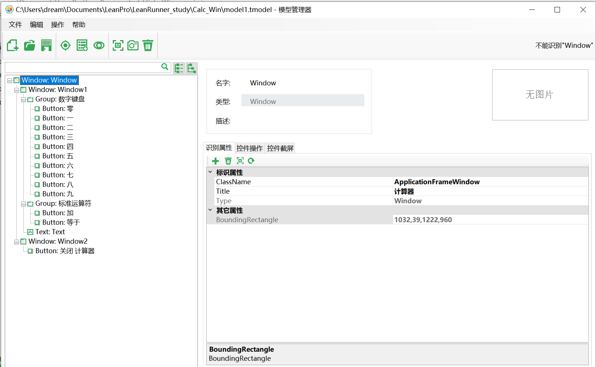
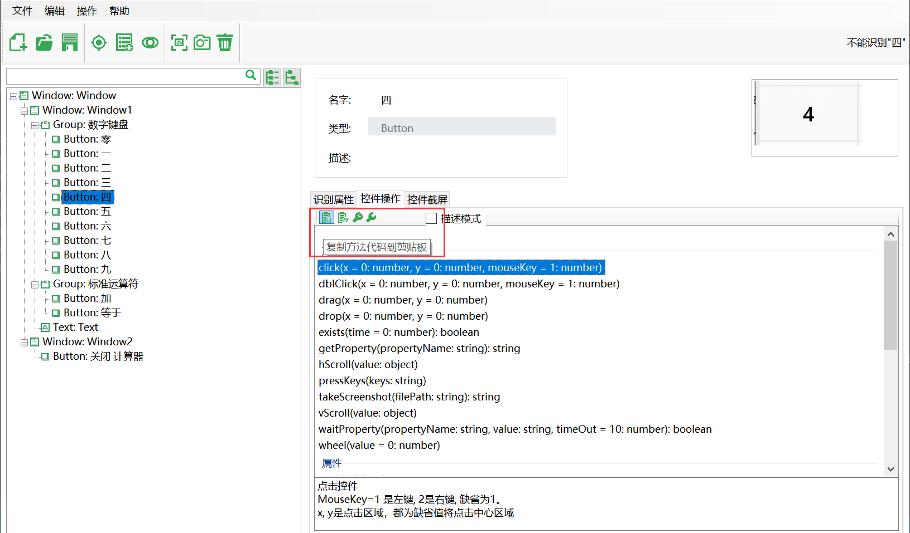
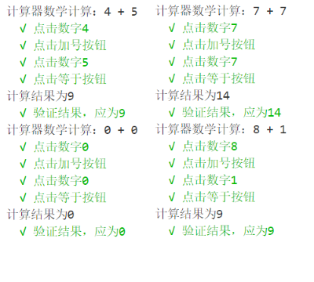
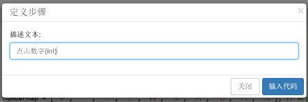
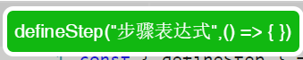

# 演练：自动化Windows计算器的操作

本文将教会您通过LeanRunner创建Windows计算器应用的RPA自动化脚本，并在控制器上设置它的执行。

## 建立项目及框架

为了自动化操作计算器，我们可以先定义操作的步骤：

1. 点击"**文件**"=>"**新建项目**"，选择Windows模板，项目命名为AutoCalc：

   

2. 新建的项目有一个脚本文件main.js以及一个模型管理文件`model1.tmodel`。请在main.js中定义`addSample`函数。

3. 在`addSample`函数中定义下列的场景和步骤：

    ```gherkin
    场景：计算器数学计算
    * 点击数字a
    * 点击加法按钮
    * 点击数字b
    * 点击等于按钮
    ```

    通过在工具箱上拖拽对应的步骤可以快速生成这些步骤，场景通过拖拽stepGroup，步骤通过拖拽step。例如：
    打开工具箱框架部分：

    

    拖拽step到main函数中，并输入步骤文本，如下图：

    


4. 当所有步骤都拖拽完成时，生成的`addSample`函数代码如下：

    ```javascript
        
    async function addSample() {
        await stepGroup(`计算器数学计算：4 + 5`, async () => {
            const expected = 4 + 5;
            await step(`点击数字4`, async (world) => {
            })

            await step(`点击加法按钮`, async (world) => {
            })

            await step(`点击数字5`, async (world) => {
            })

            await step(`点击等于按钮`, async (world) => {
            })

            await step(`验证结果，应为 ${expected}`, async (world) => {
            })
        })
    }

    ```
    这只是由拖拽生成的函数外壳，我们需要在里面加上适合的动作，而控件的动作可以从模型管理器中直接复制。双击点开“**项目**”=>**model1.tmodel**文件，可以看到项目中所有的控件:  

      

    接着取出相应控件的操作，比如我们要执行`数字4`对应的按钮点击操作，可以直接从模型管理器中复制代码，如红色方框所示：

      

    最后完成的代码如下：
    ```javascript
    async function addSample() {
        const expected = 4 + 5;
        await stepGroup("计算器数学计算：4 + 5", async () => {
            await step("点击数字4", async (world) => {
                await model.getButton("四").click();
            })
            await step("点击加号按钮", async (world) => {
                await model.getButton("加").click();
            })
            await step("点击数字5", async (world) => {
                await model.getButton("五").click();
            })
            await step("点击等于按钮", async (world) => {
                await model.getButton("等于").click();
            })
            await step("验证结果，应为" + expected, async (world) => {
                let name = await model.getText("Text").name(); //value is "显示为 9"
                let result = parseInt(name.substr(name.lastIndexOf(" ")));
                assert.equal(expected, result);
            })
        })
    }
    ```

    这样，`addSample`函数就完成了，虽然现在看起来还有点问题，但是我们之后再来解决。现在我们需要在`main`函数中调用它。
5. 修改main函数，调用`addSample`计算一个加法。同时，调用`Workflow.run`方法执行这个流程：

    ```javascript
    async function main() {
        await addSample(4, 5); // 传入了无效的参数，但并不会报错
    }

    Workflow.run(main);
    ```

6. 执行main.js文件，在输出面板中看到步骤的输出：

    


## 将代码复用起来
现在我们要回头解决`addSample`函数中存在的问题了，首先便是参数传递的问题，我们需要将`addSample`函数尽量的复用起来，来应对更多的测试用例。为了解决这个问题，需要实现两个功能：  

1. 将参数显示到步骤描述中，比如：传入a、b的值分别为1、3，那么步骤描述变为“点击数字1”、“点击数字3”；
2. 根据传入参数的不同点击不同的数字按钮，比如：传入a、b的值分别为1、3，那么需要先后点击“数字1按钮”、“数字2按钮”；  

第一个功能需要使用到模板字符串，将包裹步骤描述的双引号`"`替换成着重号`` ` ``，并使用`${}`包裹变量。因此我们将原来的`"计算器数学计算：4 + 5"`替换成`` `计算器数学计算：${a} + ${b}` ``。关于模板字符串更多的信息，可以点击[模板字符串 - MDN](https://developer.mozilla.org/zh-CN/docs/Web/JavaScript/Reference/template_strings)查看。  
第二个功能，可以通过建立参数到控件的对应关系来实现，这里我们通过新建了一个数组当作关系表：  
```javascript
    const numberMap = ["零", "一", "二", "三", "四", "五", "六", "七", "八", "九"];
```
通过这个数组，参数可以快速的转换成控件的名称，原来的`model.getButton("四")`可以写成`model.getButton(numberMap[4])`。  
实现这两个功能后的`addSample`函数代码如下：

```javascript
    async function addSample(a, b) {
        const expected = a + b;
        const numberMap = ["零", "一", "二", "三", "四", "五", "六", "七", "八", "九"];

        await stepGroup(`计算器数学计算：${a} + ${b}`, async () => {
            await step(`点击数字${a}`, async (world) => {
                await model.getButton(numberMap[a]).click();
            })
            await step(`点击加号按钮`, async (world) => {
                await model.getButton(`加`).click();
            })
            await step(`点击数字${b}`, async (world) => {
                await model.getButton(numberMap[b]).click();
            })
            await step(`点击等于按钮`, async (world) => {
                await model.getButton(`等于`).click();
            })
            await step(`验证结果，应为${expected}`, async (world) => {
                let name = await model.getText("Text").name(); //value is "显示为 9"
                let result = parseInt(name.substr(name.lastIndexOf(" ")));
                console.log(`计算结果为${result}`);
                assert.equal(expected, result);
            })
        })
    }
```

`main`函数中多加几组测试样例：
```javascript
    await main() {
        let process = Util.launchProcess("calc.exe");
        await Util.delay(1000);
        await addSample(4, 5);
        await addSample(0, 0);
        await addSample(7, 7);
        await addSample(8, 1);
    }
```
运行结果如下：  

  

## 使用defineStep优化结构

通常到这一步一个完整并且实用的测试就已经完成了，但是仍然有部分可以继续改进的地方。比如在`addSample`函数中，每个步骤都是定义后直接使用的，这就导致了复用上的问题：由于步骤无法复用，导致需要重复书写相似的代码——**点击数字**的步骤。因此我们可以将步骤的定义提取出来并封装成函数来复用，这里可以使用**LeanRunner**提供的`defineStep`功能来实现。    

仍然是从“**工具箱**”=>“**框架**”=>拖拽“**defineStep**”到代码中，接着定义该步骤的名称。第一个定义的是点击数字按钮的步骤，因此需要对拖拽的代码进行修改，如下：

   

拖拽生成的基本代码如下：  

```javascript
    defineStep("", async (world) => {
    })
```  

将代码修改为接受传参的形式，这里传入的参数是数字0~9，因此代码修改为如下：  

```javascript
    defineStep("点击数字{int}", async (num, world) => {
        await model.getButton(numberMap[num]).click();
    });
```

`defineStep`的使用方法如图所示，**步骤表达式**即**步骤描述**与**占位符**的组合。在上面的代码中`点击数字{int}`中的`{int}`就是作为数字占位符，代表该位置传入的值为数字，在接下来的代码中也会将其视作`Number`类型来处理。因此在后面的调用函数中也要传入相应的参数。
> 另外可用的占位符还有字符串占位符`{string}`。

  

接着就可以使用`Step`框架来直接使用步骤描述调用已经定义的语句。

```javascript
    // 直接定义和使用步骤描述
    await step(`点击数字${a}`, async (world) => {
        await model.getButton(numberMap[a]).click();
    })

    await step(`点击数字${b}`, async (world) => {
        await model.getButton(numberMap[b]).click();
    })

    // 调用defineStep定义好的步骤描述
    await step(`点击数字${a}`);
    await step(`点击数字${b}`);
```  

将所有步骤描述修改为`defineStep`预定义的格式后，完整的代码如下，或者查看根目录下的`main_finally.js`文件：

```javascript
    const { defineStep, step, stepGroup, Workflow } = require('leanrunner');
    const { TestModel, Auto } = require('leanpro.win');
    const { Util } = require('leanpro.common');
    const assert = require('assert');

    const model = TestModel.loadModel(__dirname + "\\model1.tmodel");
    const numberMap = ["零", "一", "二", "三", "四", "五", "六", "七", "八", "九"]; // Args mapping to Button-name

    //Win10 计算器自动化
    defineStep("点击数字{int}", async (num, world) => {
        await model.getButton(numberMap[num]).click();
    })

    defineStep("点击等于按钮", async (world) => {
        await model.getButton("等于").click();
    })

    defineStep("点击加号按钮", async (world) => {
        await model.getButton("加").click();
    })

    defineStep("验证结果，应为{int}", async (num, world) => {
        let name = await model.getText("Text").name(); //value is "显示为 9"
        let result = parseInt(name.substr(name.lastIndexOf(" ")));
        console.log(`计算结果为${result}`);
        assert.equal(num, result);
    })

    async function addSample(a, b) {
        const expected = a + b;
        await stepGroup(`计算器数学计算：${a} + ${b}`, async () => {
            await step(`点击数字${a}`);
            await step(`点击加号按钮`);
            await step(`点击数字${b}`);
            await step(`点击等于按钮`);
            await step(`验证结果，应为${expected}`);
        })
    }

    async function closeCalc() {
        let isSuccess = false;
        try {
            await model.getButton("关闭 计算器").click()
            isSuccess = true;
        } finally {
            return isSuccess;
        }
    }

    async function main() {
        let process = Util.launchProcess("calc.exe");
        try {
            await Util.delay(1000);
            await addSample(4, 5);
            await addSample(0, 0);
            await addSample(7, 7);
            await addSample(8, 1);
        } finally {
            console.log(await closeCalc() ? "关闭计算器成功" : "关闭计算器失败");
        }
    }

    Workflow.run(main);
```