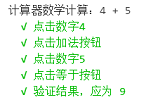

# 演练：自动化Windows计算器的操作

本文将教会您通过LeanRunner创建Windows计算器应用的RPA自动化脚本，并在服务器上执行。

## 建立项目及框架

为了自动化操作计算器，我们可以先定义操作的步骤：

1. 点击"文件"=>"新建项目"，选择Windows模板，项目命名为AutoCalc：

   

2. 新建的项目有一个脚本文件main.js以及一个模型管理文件model1.tmodel。请在main.js中定义add函数。

3. 在`add`函数中定义下列的场景和步骤：

    ```gherkin
    场景：计算器数学计算
    * 点击数字a
    * 点击加法按钮
    * 点击数字b
    * 点击等于按钮
    ```

    通过在工具箱上拖拽对应的步骤可以快速生成这些步骤，场景通过拖拽stepGroup，步骤通过拖拽step。例如：
    打开工具箱框架部分：

    

    拖拽step到main函数中，并输入步骤文本，如下图：

    


4. 当所有步骤都拖拽完成时，生成的add函数代码如下：

    ```javascript
        
    async function addSample(a, b) {
            
        await stepGroup(`计算器数学计算：4 + 5`, async () => {

            await step(`点击数字4`, async (world) => {
            })

            await step(`点击加法按钮`, async (world) => {
            })

            await step(`点击数字5`, async (world) => {
            })

            await step(`点击等于按钮`, async (world) => {
            })

            let expected = 4 + 5;
            await step(`验证结果，应为 ${expected}`, async (world) => {
            })
        })
    }

    ```

5. 修改main函数，调用add计算一个加法。同时，调用`Workflow.run`方法执行这个流程：

    ```javascript
        async function main() {
            await addSample(4, 5);
        }

        Workflow.run(main);
    ```

6. 执行main.js文件，在输出面板中看到步骤的输出：

    


